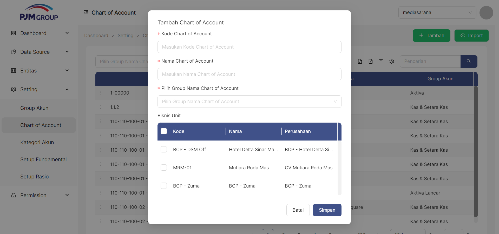

Menu **Chart of Account**, berfungsi untuk mendefinisikan Bagan Akun laporan keuangan.

### __Cara Akses__
Setting->Chart of Account

### __Cara Menampilkan Daftar Chart of Account__
1. kolom pencarian digunakan untuk melakukan filter data **Chart of Account** yang ditampilkan pada tabel

### __Cara Menambah Chart of Account__
untuk menambahkan item Chart of Account klik tombol " + Tambah" pada pojok kanan atas tabel

1. Masukan Kode Chart of Account
2. Masukan Nama Chart of Account
3. Pilih Bisnis Unit yang termasuk dalam Chart of Account yang dibuat dengan cara Ceklis Bisnit Unit yang ditampilkan pada tabel 
4. Klik tombol Simpan

### Cara Edit Chart of Account
untuk mengedit item Chart of Account klik simbol titik tiga pada pojok kiri disetiap bagian tabel
1. klik titik tiga disetiap samping kiri pada bagian tabel
2. pilih edit
3. pilih pada bagian mana yang akan diedit
4. jika sudah diedit bisa klik tombol simpan
5. jika tidak jadi mengedit bagian Chart of Account bisa klik simbol Batal

## Cara Delete Chart of Account
untuk mendelete Chart of Account klik simbol titik tiga dipojok bagian kiri disetiap tabel
1. klik simbol titik tiga dipojok kiri disetiap tabel
2. pilih Delete
3. jika benar benar ingin menghapus bagian tabel tersebut akan muncul tampilan Cancel atau Ok 
4. jika ingin menghapus nya maka klik simbol Ok
5. jika tidak jadi menghapusnya maka klik simbol cancel