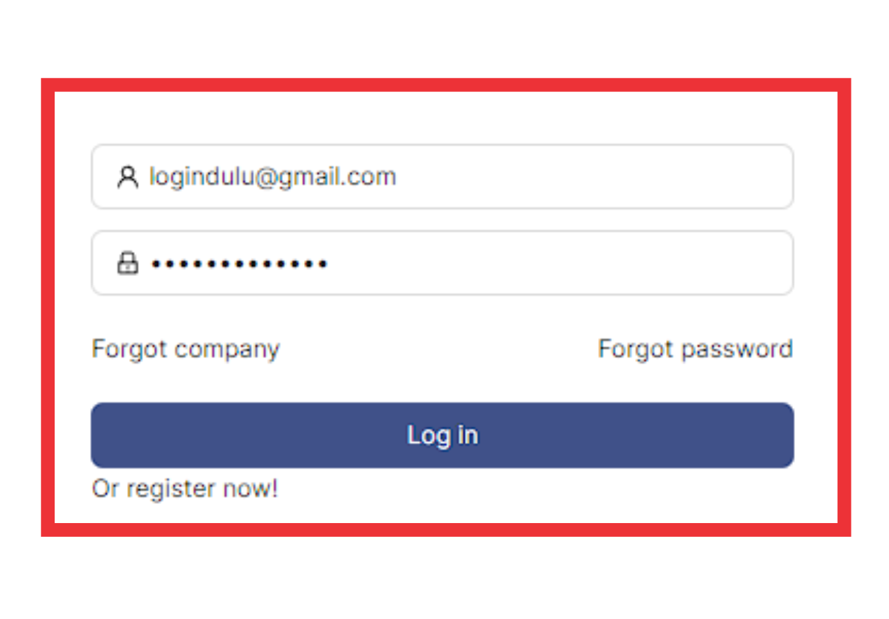

Menu **Chart of Account**, berfungsi untuk mendefinisikan Bagan Akun laporan keuangan.

### __Langkah-langkah mengakses Chart of Account__
1. Buka halaman website dashboard dengan situs https://analytics.ecespro.id

&nbsp;&nbsp;&nbsp;&nbsp;&nbsp;&nbsp;&nbsp;

2. Setelah itu, jika user belum login maka silahkan login terlebih dahulu.

3. Pilih modul Setting lalu setelah itu pilih menu Chart of Account

---

### __Langkah-langkah Menampilkan Daftar Setup Rasio__
1. Setelah kita berhasil mengakses menu Chart of Account makan sistem otomatis akan menampilkan data list Chart of Account.

---

### __Cara Menambah Chart of Account__
untuk menambahkan item Chart of Account klik tombol " + Tambah" pada pojok kanan atas tabel

1. Masukan Kode Chart of Account

2. Masukan Nama Chart of Account

3. PilihPilih Group Nama Chart of Account 

3. Pilih Chart Of Account yang termasuk dalam Chart of Account yang dibuat dengan cara Ceklis Bisnit Unit yang ditampilkan pada tabel 

4. Klik tombol Simpan

---
### __Cara Edit Chart of Account__
untuk mengedit item Chart of Account klik simbol titik tiga pada pojok kiri disetiap bagian tabel
1. klik titik tiga disetiap samping kiri pada bagian tabel

2. pilih edit

3. Masukan Nama Chart of Account

4. Pilih Group Nama Chart of Account 

5. Pilih Group Nama Chart of Account 

6. Pilih Chart Of Account yang termasuk dalam Chart of Account yang dibuat dengan cara Ceklis Bisnit Unit yang ditampilkan pada tabel

7. jika sudah diedit bisa klik tombol simpan

8. jika tidak jadi mengedit bagian Chart of Account bisa klik simbol Batal

---

### __Cara Delete Chart of Account__
untuk mendelete Chart of Account klik simbol titik tiga dipojok bagian kiri disetiap tabel
1. klik simbol titik tiga dipojok kiri disetiap tabel

2. pilih Delete

3. jika benar benar ingin menghapus bagian tabel tersebut akan muncul tampilan Cancel atau Ok 

4. jika ingin menghapus nya maka klik simbol Ok

5. jika tidak jadi menghapusnya maka klik simbol cancel

---

### __Langkah-langkah import data Chart Of Account__
Mengimpor data memungkinkan user mengupload data dari sumber eksternal dan menggabungkannya dengan data yang dikumpulkan oleh pengguna di sistem. 
1. Pilih button **"Import"** pada bagian kanan atas tabel.

2. Setelah itu, sistem akan menampilkan pop-up formulir.

3. Sebelum melakukan import data file excel, user harus memastikan file yang akan di import telah sesuai dengan template yang telah disediakan.
4. Untuk mendonwload template, user meng-klik button **Download Template** pada bagian kanan atas modal import data.

5. Setelah itu, pastikan user telah menyiapkan file data berupa excel yang telah sesuai dengan panduan **Download Template**.
6. Klik formulir import data lalu pilih file data yang akan di import atau user bisa melakukan drag dan drop data kedalam formulir.

7. Setelah itu, jika user telah memastikan formulir Import data telah sesuai maka pilih button **import** untuk menyimpan data tersebut dan jika user ingin membatalkan formulir Chart Of Account maka pilih button **batal**.

8. Jika data tersebut berhasil **tersimpan** maka sistem akan menampilkan pesan berhasil pada bagian kanan atas tabel.

---
<!-- fitu tabel -->
### __Langkah-langkah menggunakan fitur-fitur pada tabel Chart of Account__

Fitur adalah fitur khusus yang disertakan dalam alat. fitur yang telah tersedia pada Bisnis Unit antara lain, yakni :

1. Fitur pencarian data
Fungsi pencarian data memungkinkan user memfilter data sesuai dengan kriteria.

2. Fitur show/Hide tabel
Fungsi show/hide tabel adalah untuk menampilkan atau menyembunyikan field pada tabel.

3. Fitur ukuran tabel.
Berfungsi untuk mengatur ukuran tabel.

4. Fitur export PDF
Fungsi dari export PDF yaitu untuk mengeluarkan dan menyimpan data supaya dapat di Import kedalam file berbentuk PDF.

5. Fitur export Excel
Fungsi dari export Excel yaitu untuk mengeluarkan dan menyimpan data supaya dapat di Import kedalam file berbentuk Xls.

