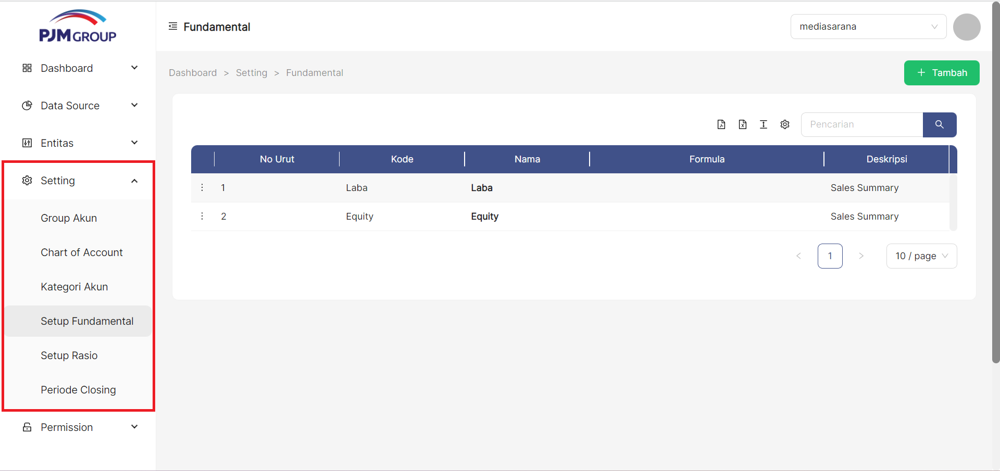
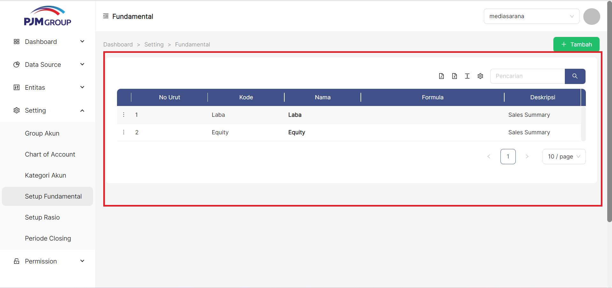
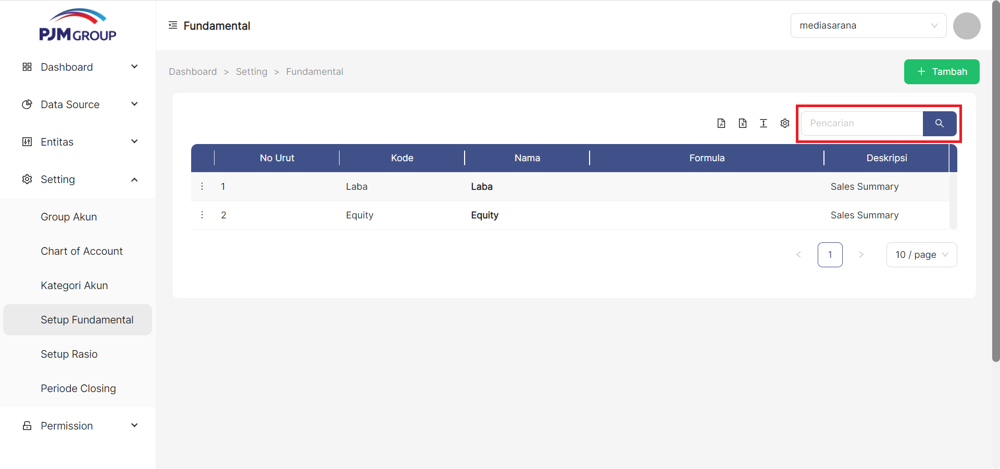
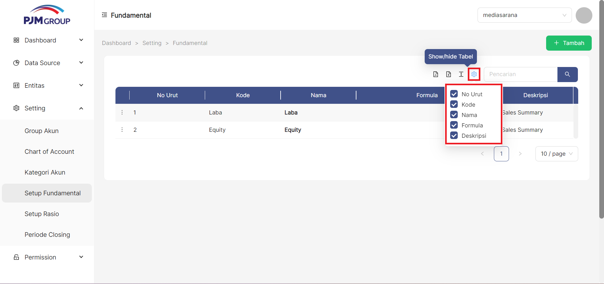
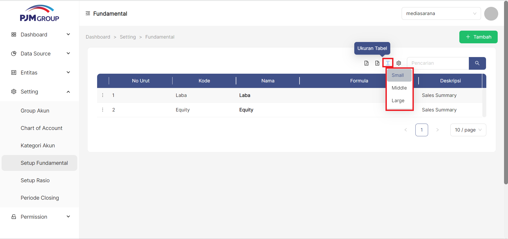
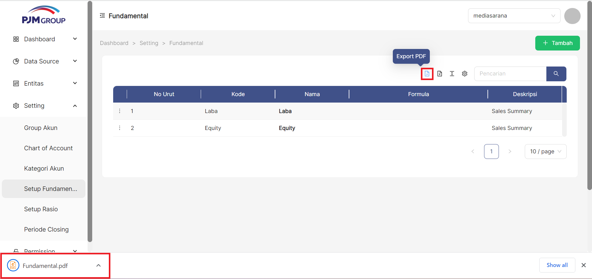
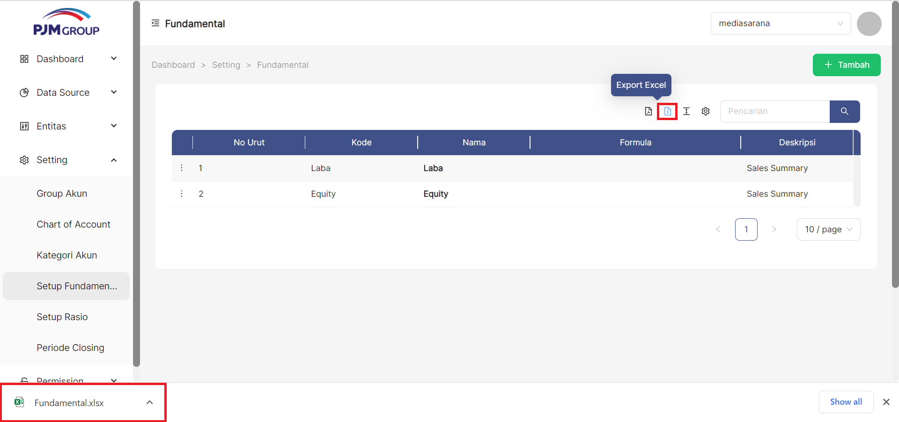

Menu **Setup Fundamental**, berfungsi untuk mendefinisikan item Fundamental laporan keuangan.

### __Langkah-langkah mengakses Setup Fundamental__
1. Buka halaman website dashboard dengan situs https://analytics.ecespro.id

&nbsp;&nbsp;&nbsp;&nbsp;&nbsp;&nbsp;&nbsp;

2. Setelah itu, jika user belum login maka silahkan login terlebih dahulu.

3. Pilih modul Setting lalu setelah itu pilih menu Setup Fundamental

### __Langkah-langkah Menampilkan Daftar Setup Rasio__
1. Setelah kita berhasil mengakses menu Setup Fundamental maka sistem otomatis akan menampilkan data list Setup Fundamental.

---

### __Cara Menambah Fundamental__
untuk menambahkan item Fundamental klik tombol " + Tambah" pada pojok kanan atas tabel

1. Masukan Nomer Urut

2. Pilih Induk Fundamental

3. Masukan Kode Fundamental

4. Masukan Nama Fundamental

5. klik tombol "**+ Load Formula**" untuk memilih formula yang digunakan

5. Masukan Deskripsi

6. Klik tombol Simpan

### __Cara Edit Fundamental__
untuk mengedit item Fundamental klik simbol titik tiga pada pojok kiri disetiap bagian tabel
1. klik titik tiga disetiap samping kiri pada bagian tabel

2. pilih edit

3. Masukan Nomer Urut

4. Pilih Induk Fundamental

5. Masukan Kode Fundamental

6. Masukan Nama Fundamental

7. klik tombol "**+ Load Formula**" untuk memilih formula yang digunakan

8. Masukan Deskripsi

9. Klik tombol Simpan

10. jika tidak jadi mengedit bagian Fundamental bisa klik simbol Batal

### __Cara Delete Fundamental__
untuk mendelete Fundamental klik simbol titik tiga dipojok bagian kiri disetiap tabel
1. klik simbol titik tiga dipojok kiri disetiap tabel

2. pilih Delete

<!-- 3. jika benar benar ingin menghapus bagian tabel tersebut akan muncul tampilan Cancel atau Ok 
 -->
3. jika ingin menghapus nya maka klik simbol Ok

4. jika tidak jadi menghapusnya maka klik simbol cancel

---

### __Langkah-langkah menggunakan fitur-fitur pada tabel Setup Fundamental__
---
Fitur adalah fitur khusus yang disertakan dalam alat. fitur yang telah tersedia pada Bisnis Unit antara lain, yakni :

1. Fitur pencarian data
Fungsi pencarian data memungkinkan user memfilter data sesuai dengan kriteria.

2. Fitur show/Hide tabel
Fungsi show/hide tabel adalah untuk menampilkan atau menyembunyikan field pada tabel.

3. Fitur ukuran tabel.
Berfungsi untuk mengatur ukuran tabel.

4. Fitur export PDF
Fungsi dari export PDF yaitu untuk mengeluarkan dan menyimpan data supaya dapat di Import kedalam file berbentuk PDF.

5. Fitur export Excel
Fungsi dari export Excel yaitu untuk mengeluarkan dan menyimpan data supaya dapat di Import kedalam file berbentuk Xls.
