Menu **Setup Fundamental**, berfungsi untuk mendefinisikan item Fundamental laporan keuangan.

### __Cara Akses__
Setting->Setup Fundamental

### __Cara Menampilkan Daftar Fundamental__
1. kolom pencarian digunakan untuk melakukan filter data **Fundamental** yang ditampilkan pada tabel

### __Cara Menambah Fundamental__
untuk menambahkan item Fundamental klik tombol " + Tambah" pada pojok kanan atas tabel
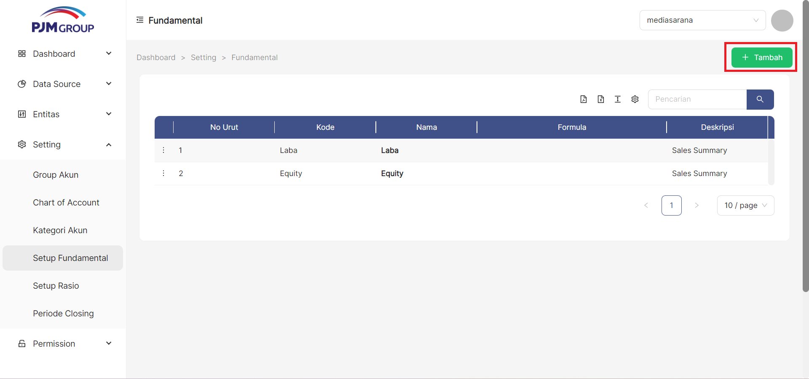
1. Masukan Nomer Urut
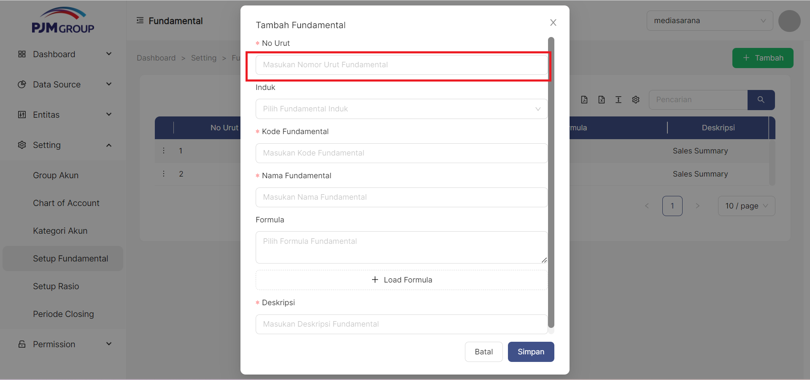
2. Pilih Induk Fundamental
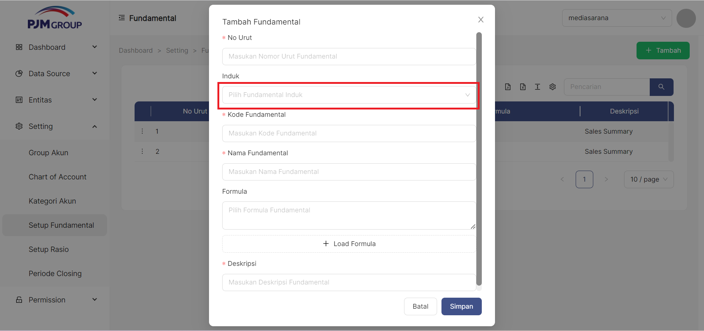
3. Masukan Kode Fundamental
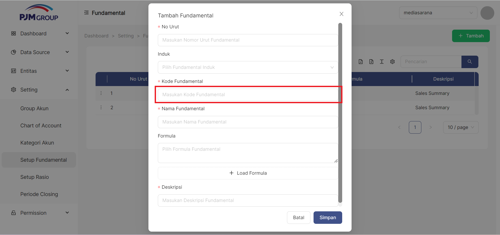
4. Masukan Nama Fundamental
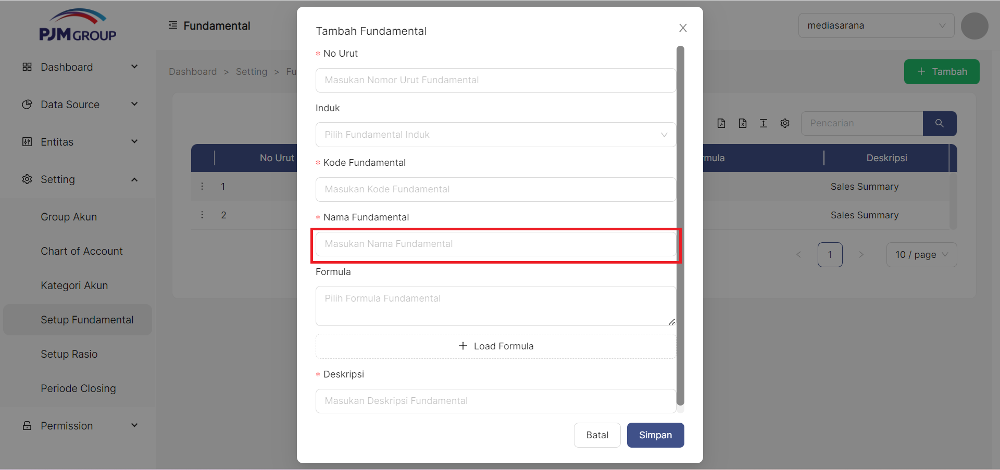
5. klik tombol "**+ Load Formula**" untuk memilih formula yang digunakan
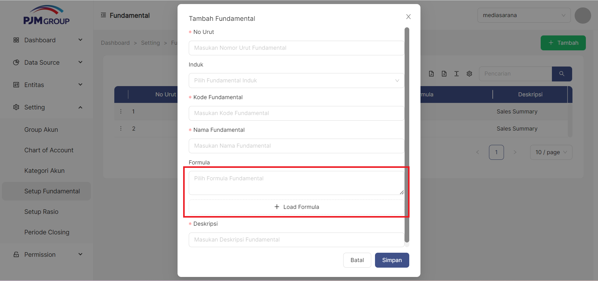
5. Masukan Deskripsi
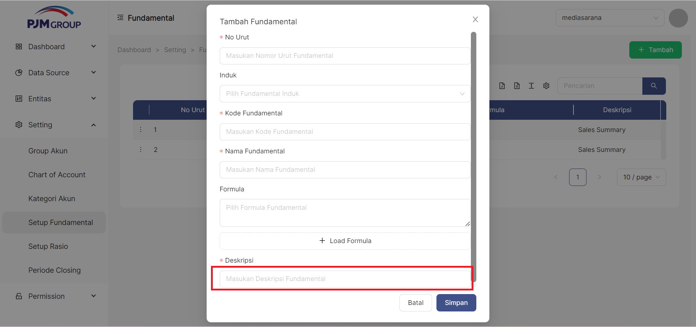
6. Klik tombol Simpan
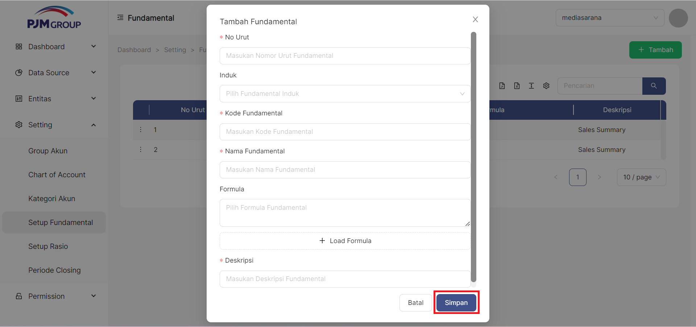

### Cara Edit Fundamental
untuk mengedit item Fundamental klik simbol titik tiga pada pojok kiri disetiap bagian tabel
1. klik titik tiga disetiap samping kiri pada bagian tabel
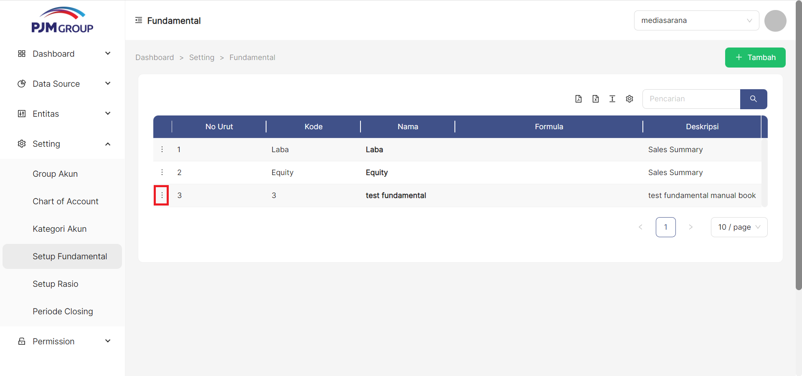
2. pilih edit
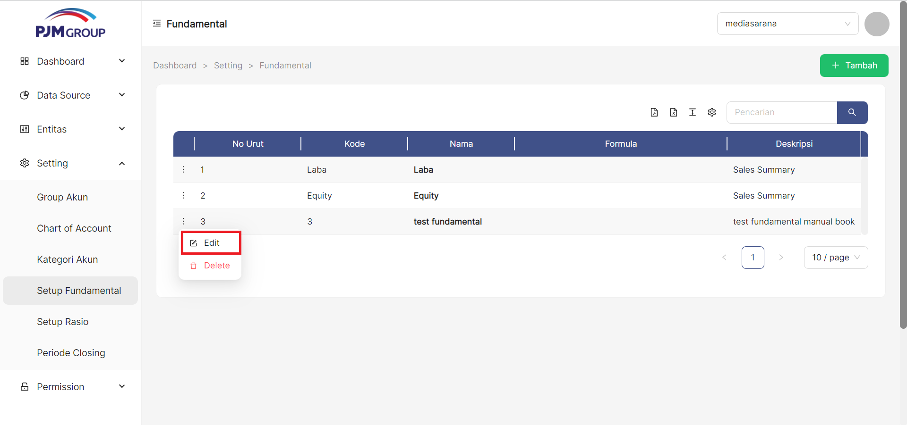
3. Masukan Nomer Urut
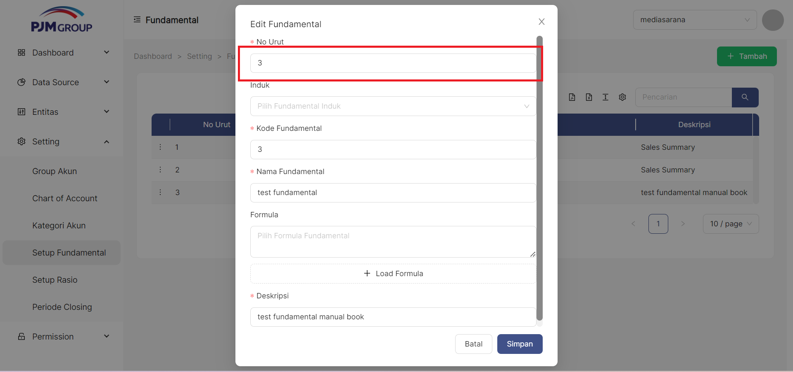
4. Pilih Induk Fundamental
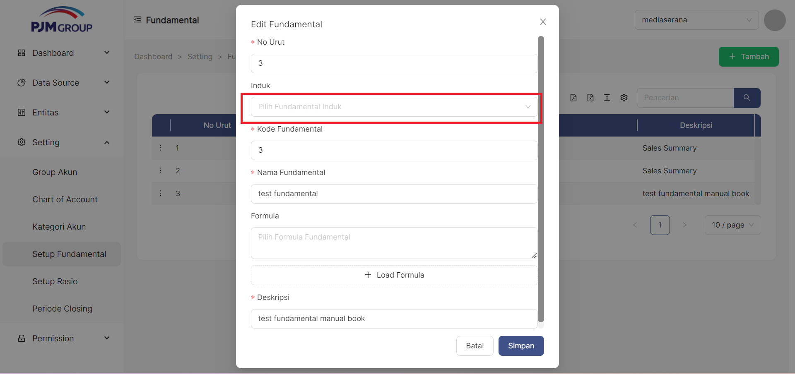
5. Masukan Kode Fundamental
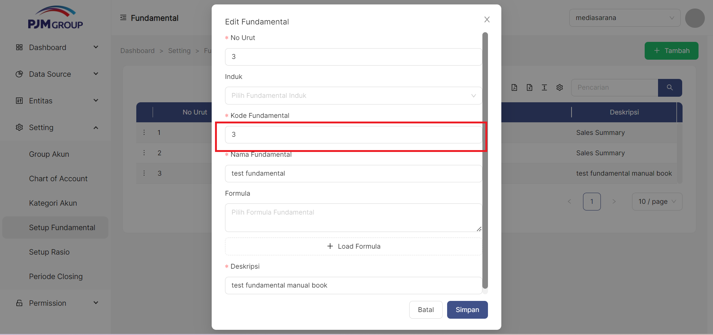
6. Masukan Nama Fundamental
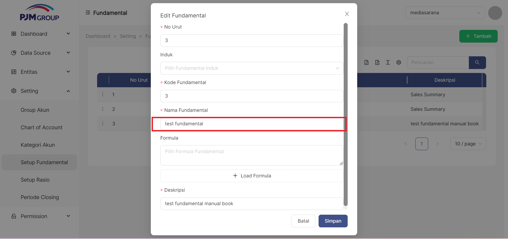
7. klik tombol "**+ Load Formula**" untuk memilih formula yang digunakan
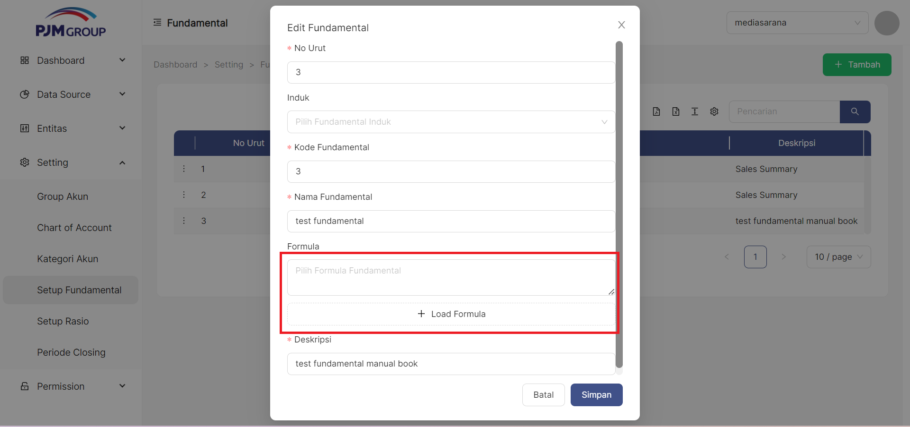
8. Masukan Deskripsi
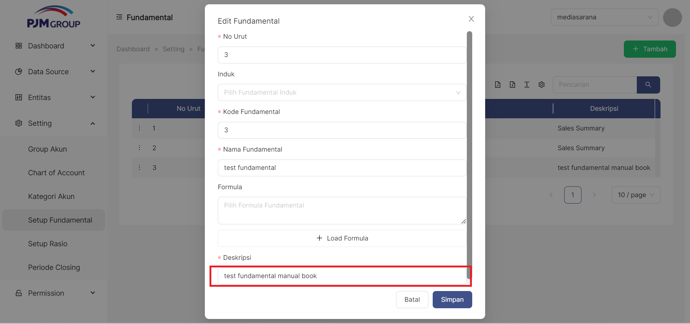
9. Klik tombol Simpan
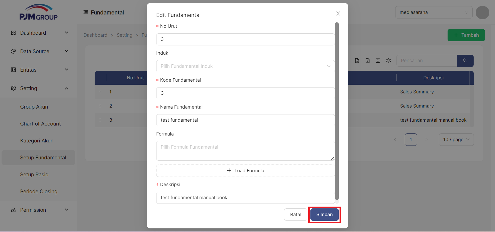
10. jika tidak jadi mengedit bagian Fundamental bisa klik simbol Batal

### Cara Delete Fundamental
untuk mendelete Fundamental klik simbol titik tiga dipojok bagian kiri disetiap tabel
1. klik simbol titik tiga dipojok kiri disetiap tabel

2. pilih Delete
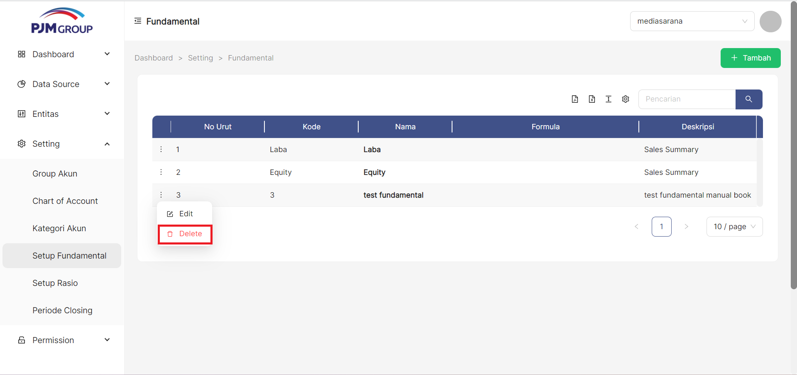
<!-- 3. jika benar benar ingin menghapus bagian tabel tersebut akan muncul tampilan Cancel atau Ok 
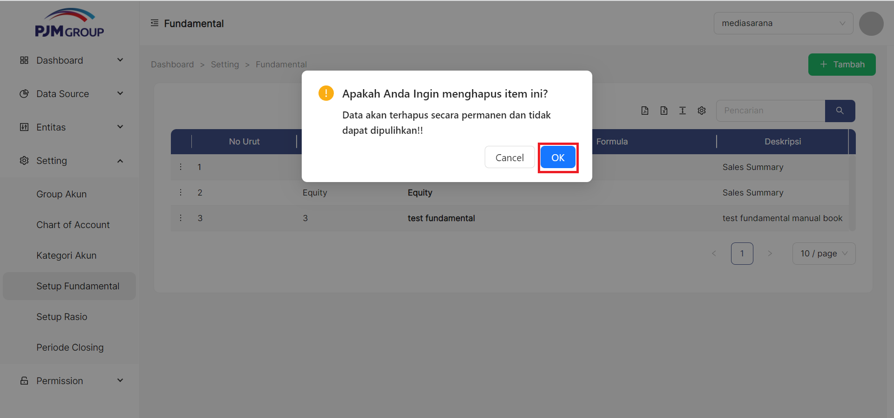 -->
3. jika ingin menghapus nya maka klik simbol Ok

4. jika tidak jadi menghapusnya maka klik simbol cancel