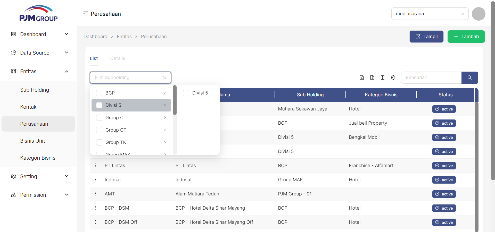

Menu **Setup Rasio**, berfungsi untuk mendefinisikan item rasio laporan keuangan.

### __Cara Akses__
Setting->Setup Rasio

### __Cara Menampilkan Daftar Rasio__
1. kolom pencarian digunakan untuk melakukan filter data **Rasio** yang ditampilkan pada table

### __Cara Menambah Rasio__
untuk menambahkan item Rasio klik tombol " + Tambah" pada pojok kanan atas tabel

1. Masukan Nomer Urut
2. Pilih Rasio Kategori
3. Masukan Kode Rasio
4. Masukan Nama Rasio
5. Masukan Deskripsi Rasio
6. klik tombol "**+ Load Formula**" untuk memilih formula yang digunakan
7. Klik tombol Simpan

### Cara Edit Rasio
untuk mengedit item Rasio klik simbol titik tiga pada pojok kiri disetiap bagian tabel
1. klik titik tiga disetiap samping kiri pada bagian tabel
2. pilih edit
3. pilih pada bagian mana yang akan diedit
4. jika sudah diedit bisa klik tombol simpan
5. jika tidak jadi mengedit bagian Rasio bisa klik simbol Batal

## Cara Delete Rasio
untuk mendelete Rasio klik simbol titik tiga dipojok bagian kiri disetiap tabel
1. klik simbol titik tiga dipojok kiri disetiap tabel
2. pilih Delete
3. jika benar benar ingin menghapus bagian tabel tersebut akan muncul tampilan Cancel atau Ok 
4. jika ingin menghapus nya maka klik simbol Ok
5. jika tidak jadi menghapusnya maka klik simbol cancel