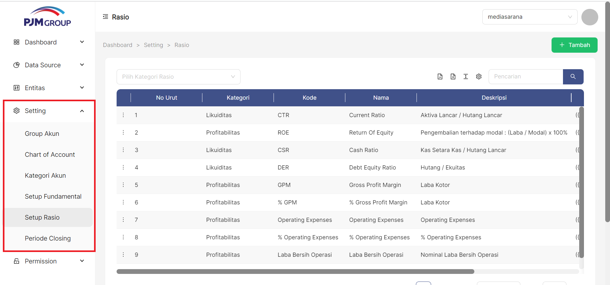
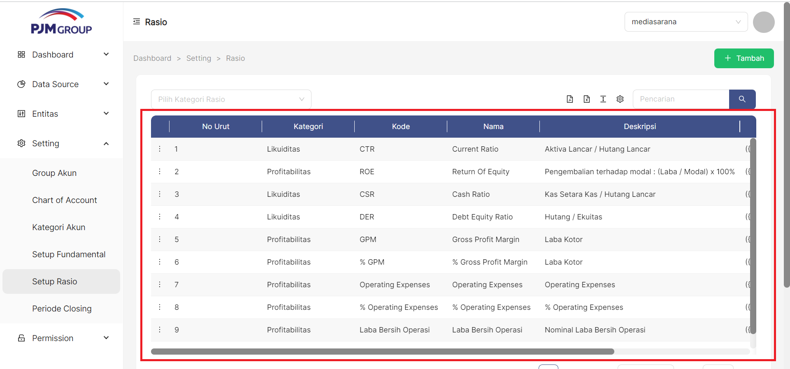
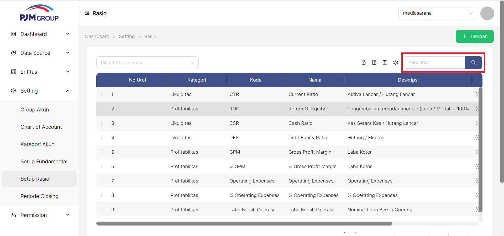
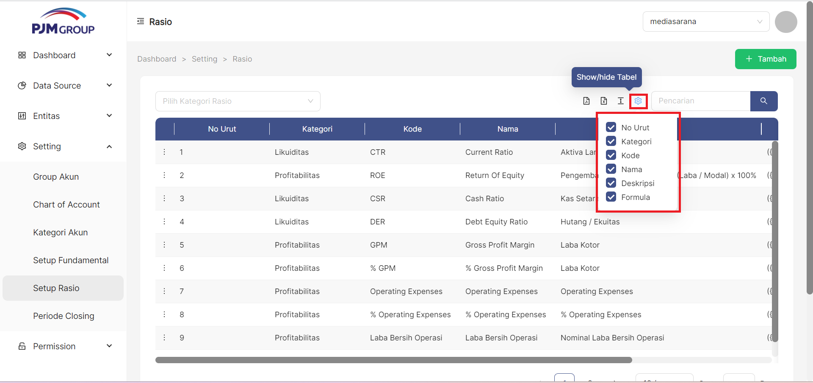
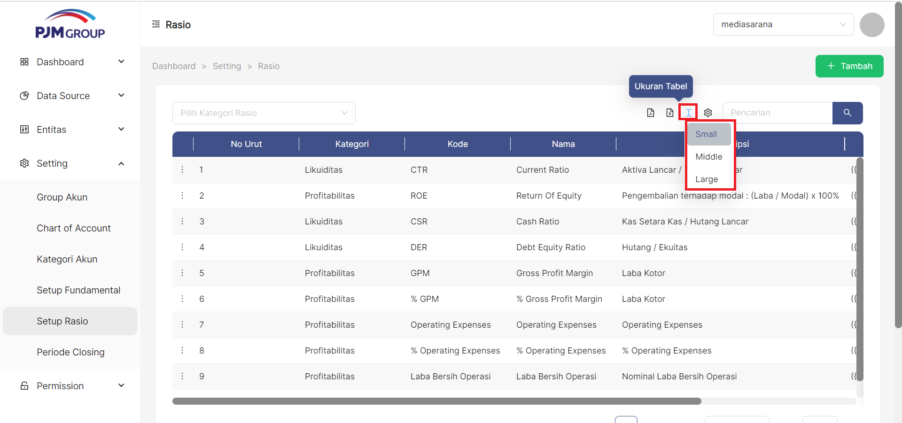
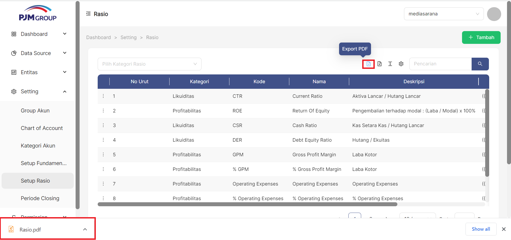
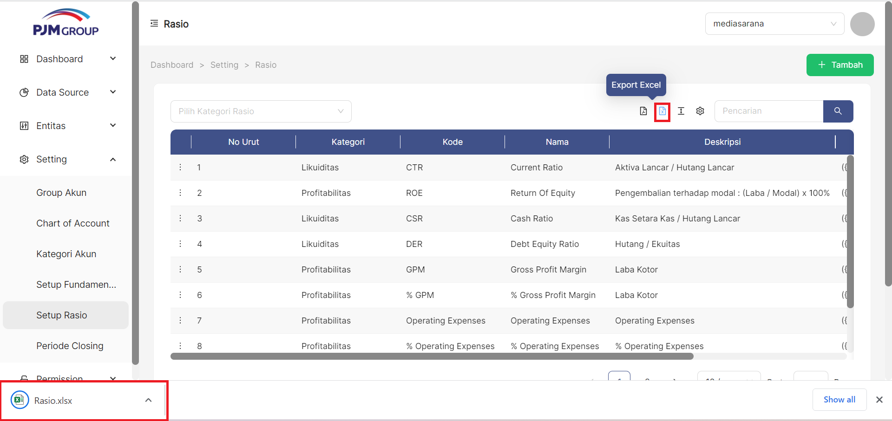

Menu **Setup Rasio**, berfungsi untuk mendefinisikan item rasio laporan keuangan.

### __Langkah-langkah mengakses Setup Rasio__
1. Buka halaman website dashboard dengan situs https://analytics.ecespro.id

&nbsp;&nbsp;&nbsp;&nbsp;&nbsp;&nbsp;&nbsp;

2. Setelah itu, jika user belum login maka silahkan login terlebih dahulu.

3. Pilih modul Setting lalu setelah itu pilih menu Kategori Bisnis

### __Langkah-langkah Menampilkan Daftar Setup Rasio__
1. Setelah kita berhasil mengakses menu Kategori Akun makan sistem otomatis akan menampilkan data list Kategori Akun.

---

### __Cara Menambah Rasio__
untuk menambahkan item Rasio klik tombol " + Tambah" pada pojok kanan atas tabel

1. Masukan Nomer Urut

2. Pilih Rasio Kategori

3. Masukan Kode Rasio

4. Masukan Nama Rasio

5. Masukan Deskripsi Rasio

6. klik tombol "**+ Load Formula**" untuk memilih formula yang digunakan

7. Klik tombol Simpan

---
### Cara Edit Rasio
untuk mengedit item Rasio klik simbol titik tiga pada pojok kiri disetiap bagian tabel

1. klik titik tiga disetiap samping kiri pada bagian tabel

2. pilih edit

3. pilih pada bagian mana yang akan diedit

4. jika sudah diedit bisa klik tombol simpan
5. jika tidak jadi mengedit bagian Rasio bisa klik simbol Batal

---
### Cara Delete Rasio
untuk mendelete Rasio klik simbol titik tiga dipojok bagian kiri disetiap tabel
1. klik simbol titik tiga dipojok kiri disetiap tabel

2. pilih Delete

3. jika benar benar ingin menghapus bagian tabel tersebut akan muncul tampilan Cancel atau Ok 

4. jika ingin menghapus nya maka klik simbol Ok

5. jika tidak jadi menghapusnya maka klik simbol cancel

---

### __Langkah-langkah menggunakan fitur-fitur pada tabel Setup Rasio__
---
Fitur adalah fitur khusus yang disertakan dalam alat. fitur yang telah tersedia pada Bisnis Unit antara lain, yakni :

1. Fitur pencarian data
Fungsi pencarian data memungkinkan user memfilter data sesuai dengan kriteria.

2. Fitur show/Hide tabel
Fungsi show/hide tabel adalah untuk menampilkan atau menyembunyikan field pada tabel.

3. Fitur ukuran tabel.
Berfungsi untuk mengatur ukuran tabel.

4. Fitur export PDF
Fungsi dari export PDF yaitu untuk mengeluarkan dan menyimpan data supaya dapat di Import kedalam file berbentuk PDF.

5. Fitur export Excel
Fungsi dari export Excel yaitu untuk mengeluarkan dan menyimpan data supaya dapat di Import kedalam file berbentuk Xls.
