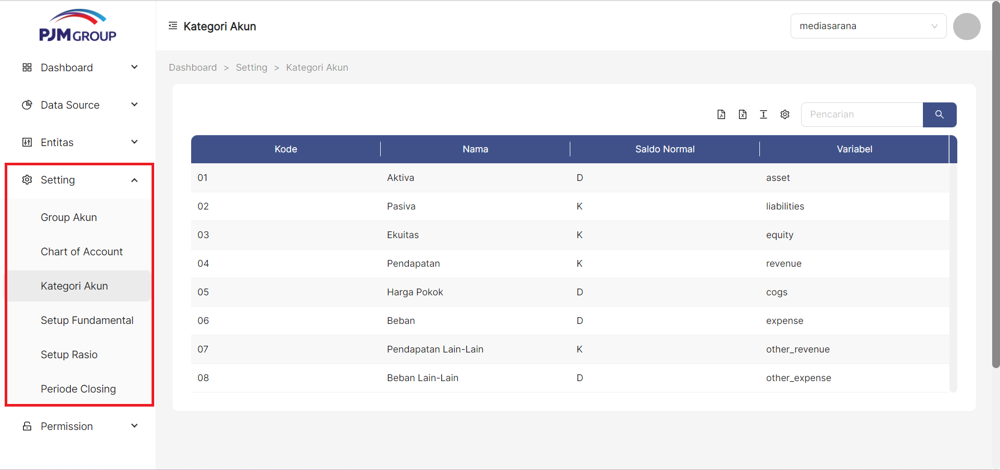
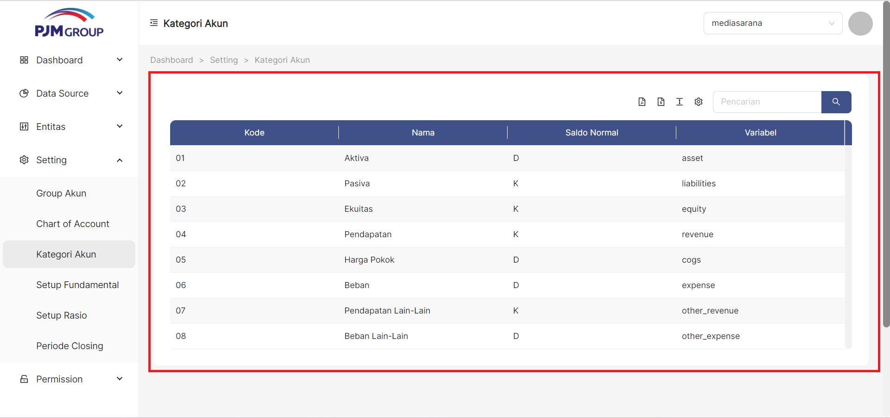
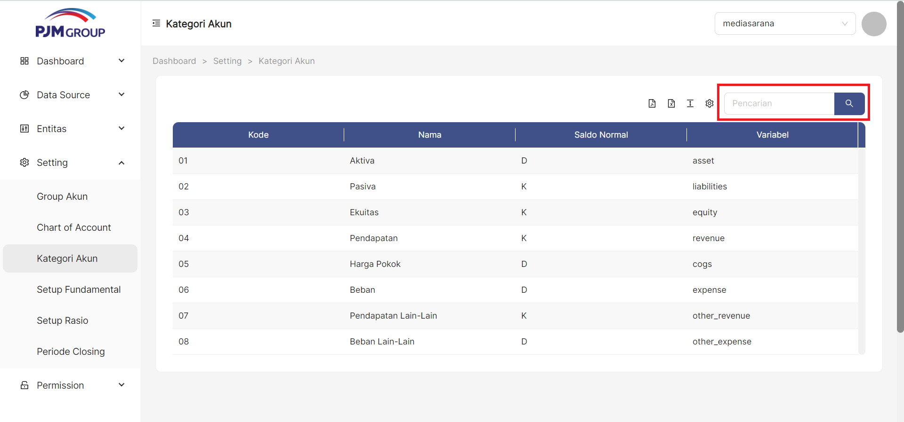
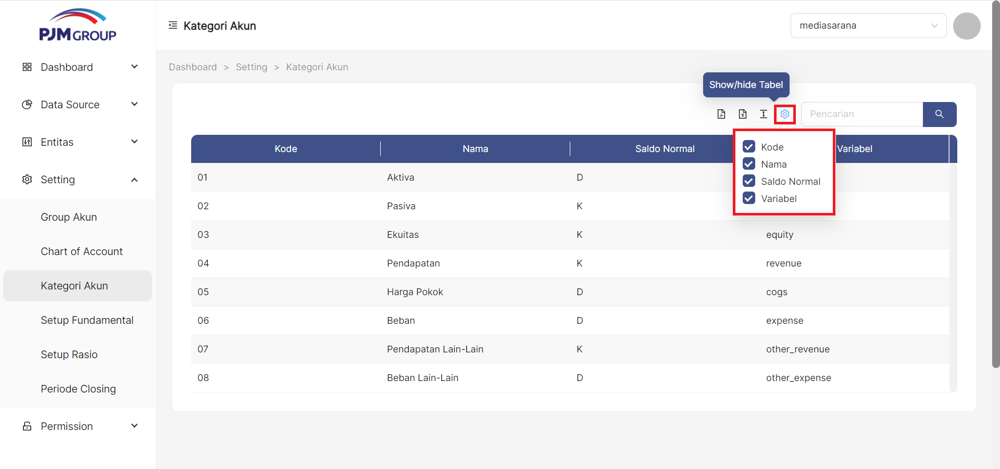
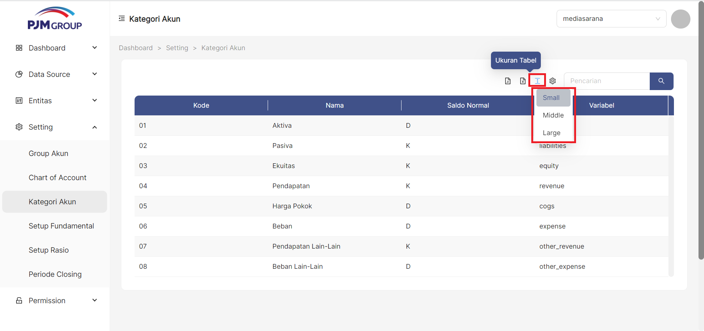
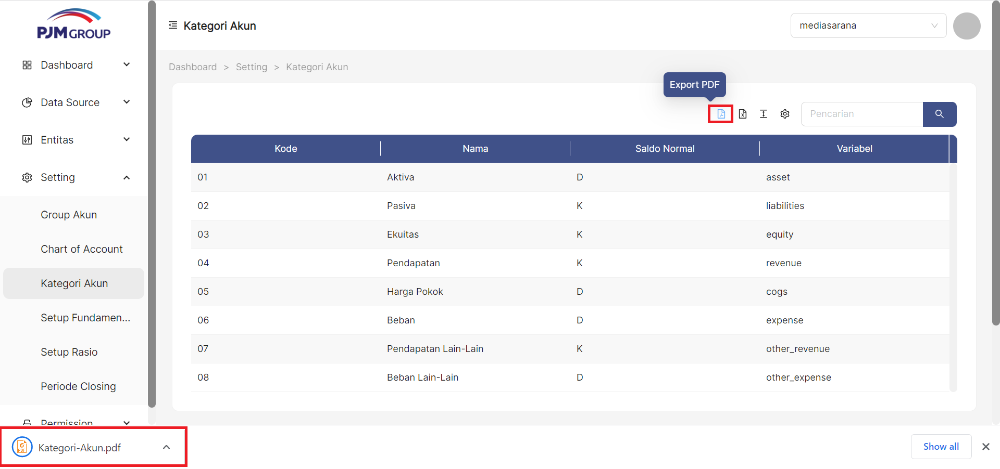
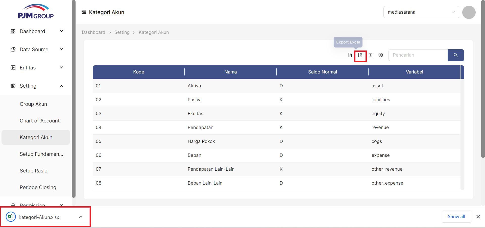

Menu **Kategori Akun**, berfungsi untuk mengatur kode akun yang akan digunakan dalam group akun.

### __Langkah-langkah mengakses Kategori Akun__
1. Buka halaman website dashboard dengan situs https://analytics.ecespro.id

&nbsp;&nbsp;&nbsp;&nbsp;&nbsp;&nbsp;&nbsp;

2. Setelah itu, jika user belum login maka silahkan login terlebih dahulu.

3. Pilih modul Setting lalu setelah itu pilih menu Kategori Bisnis

### __Langkah-langkah Menampilkan Daftar Kategori Akun__
1. Setelah kita berhasil mengakses menu Kategori Akun makan sistem otomatis akan menampilkan data list Kategori Akun.

---

### __Langkah-langkah menggunakan fitur-fitur pada tabel Kategori Akun__
---
Fitur adalah fitur khusus yang disertakan dalam alat. fitur yang telah tersedia pada Bisnis Unit antara lain, yakni :

1. Fitur pencarian data
Fungsi pencarian data memungkinkan user memfilter data sesuai dengan kriteria.

2. Fitur show/Hide tabel
Fungsi show/hide tabel adalah untuk menampilkan atau menyembunyikan field pada tabel.

3. Fitur ukuran tabel.
Berfungsi untuk mengatur ukuran tabel.

4. Fitur export PDF
Fungsi dari export PDF yaitu untuk mengeluarkan dan menyimpan data supaya dapat di Import kedalam file berbentuk PDF.

5. Fitur export Excel
Fungsi dari export Excel yaitu untuk mengeluarkan dan menyimpan data supaya dapat di Import kedalam file berbentuk Xls.
