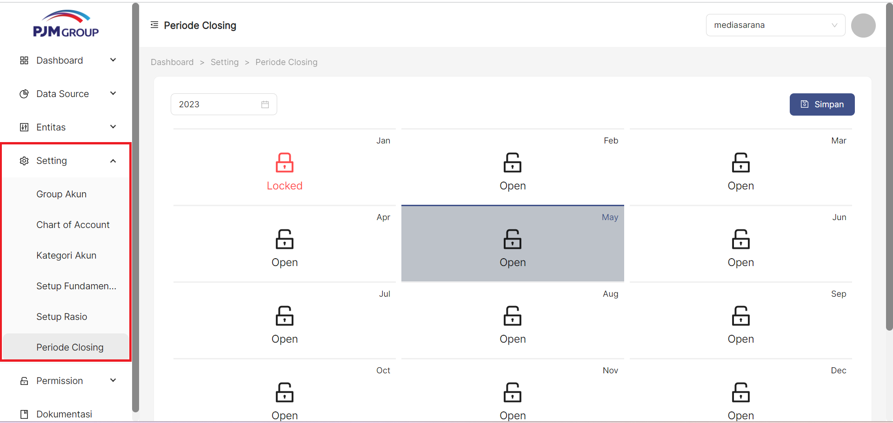
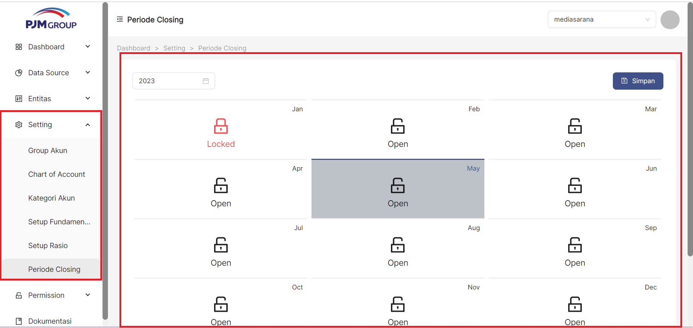
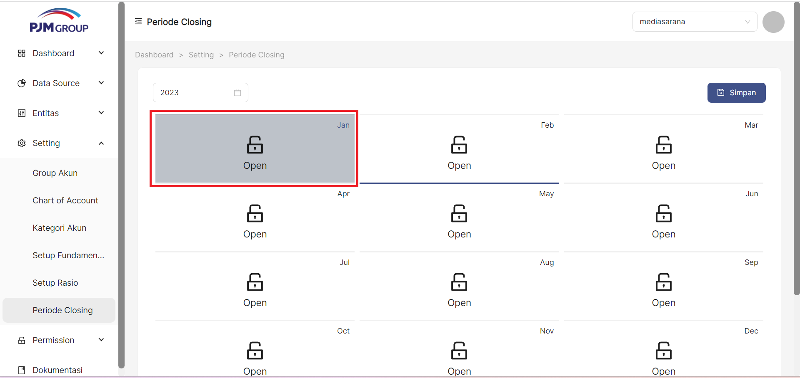
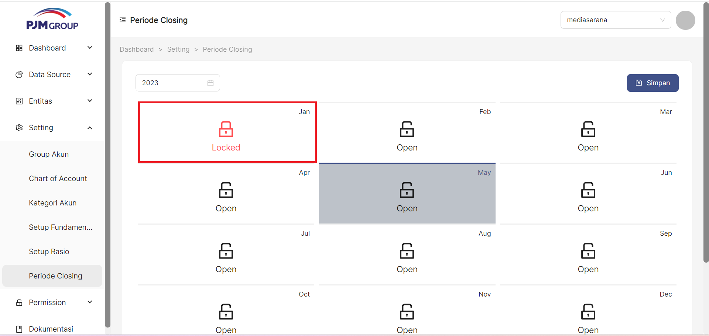
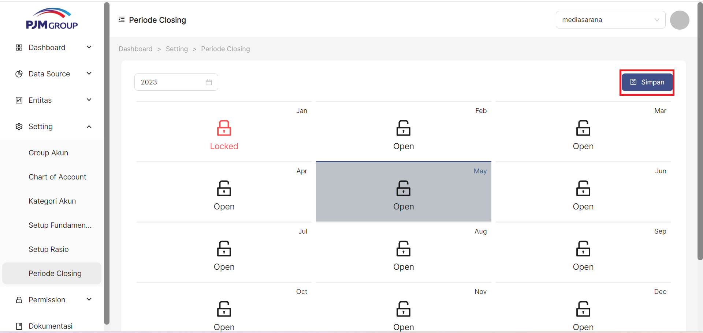
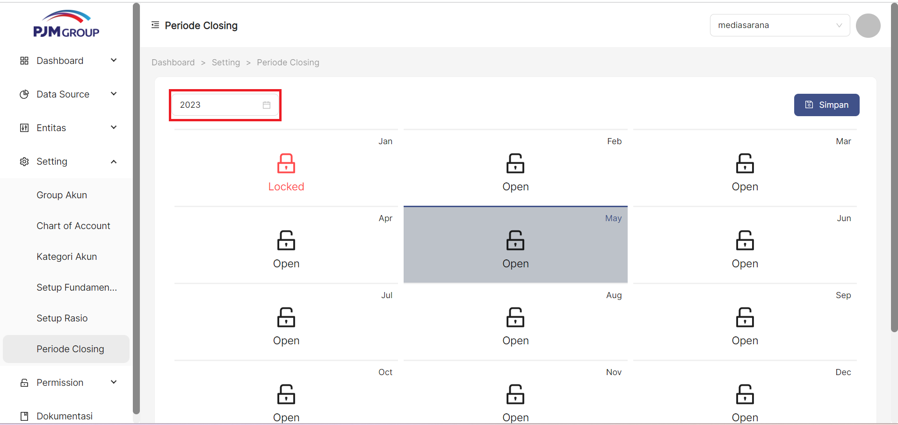

Menu **Periode Closing**, berfungsi untuk __mengunci transaksi trial balance__ per periode yang dipilih. Setelah ditentukan periode yang dikunci, maka transaksi trial balance yang ada pada periode yang telah dikunci tidak dapat dilakukan tambah data, update ataupun hapus data trial balance

### __Langkah-langkah mengakses Periode Closing__

1. Buka halaman website dashboard dengan situs https://analytics.ecespro.id

```
https://analytics.ecespro.id
```

2. Setelah itu, jika user belum login maka silahkan login terlebih dahulu.

<br></br><br></br>

3. Pilih modul Setting lalu setelah itu pilih menu Periode Closing

<br></br><br></br>

---
### __Langkah-langkah Menampilkan Daftar Periode Closing__

1. Setelah kita berhasil mengakses menu Periode Closing makan sistem otomatis akan menampilkan data tabel kalender Periode Closing.

<br></br><br></br>

### __Langkah-langkah Mengunci Periode Closing__

1. Pilih __Periode__ yang akan dikunci.

<br></br><br></br>

2. Status Periode akan terkunci dengan ditandai dengan kunci berwarna merah

<br></br><br></br>

3. Klik tombol __Simpan__ untuk konfirmasi penguncian atau pembukaan kunci

<br></br><br></br>

---

### __Langkah-langkah menggunakan fitur-fitur pada tabel Periode Closing__


Fitur adalah fitur khusus yang disertakan dalam alat. fitur yang telah tersedia pada Periode Closing antara lain, yakni :

1. Fitur filter periode
Fungsi filter periode data memungkinkan user memfilter data sesuai dengan periode tahun yang dipilih.

<br></br><br></br>
