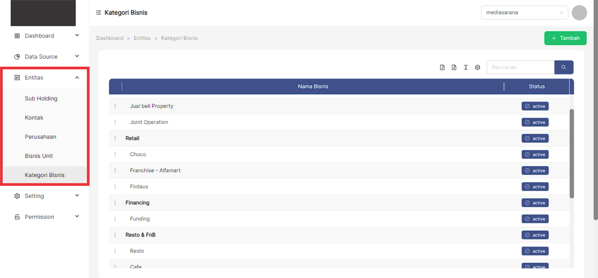
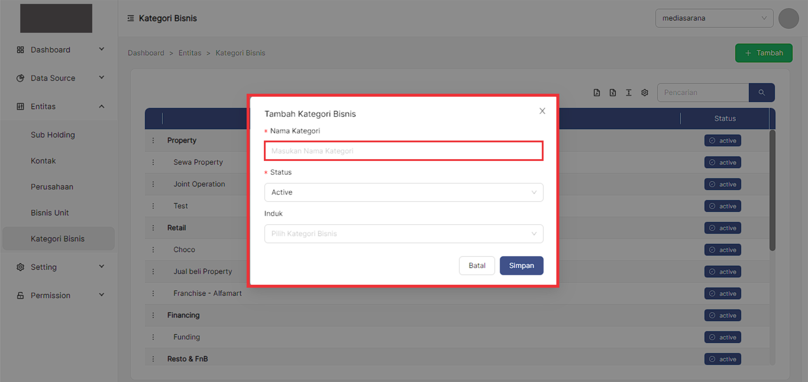
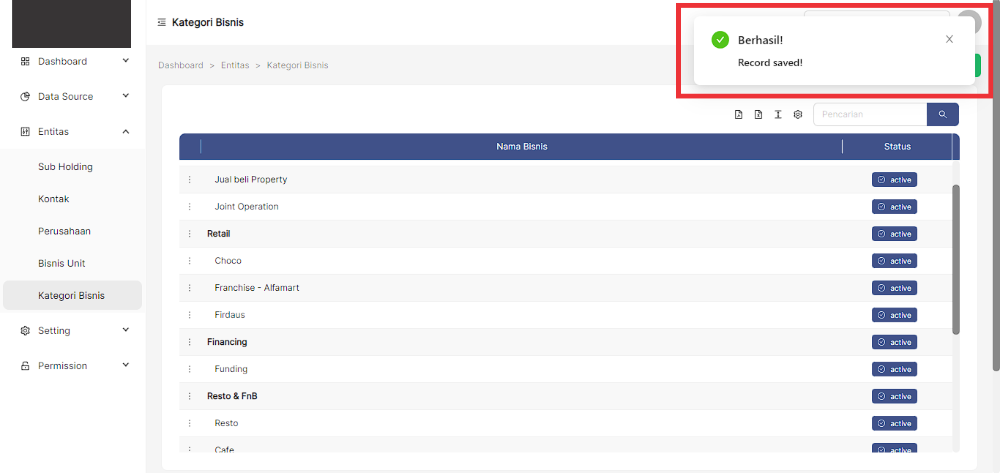
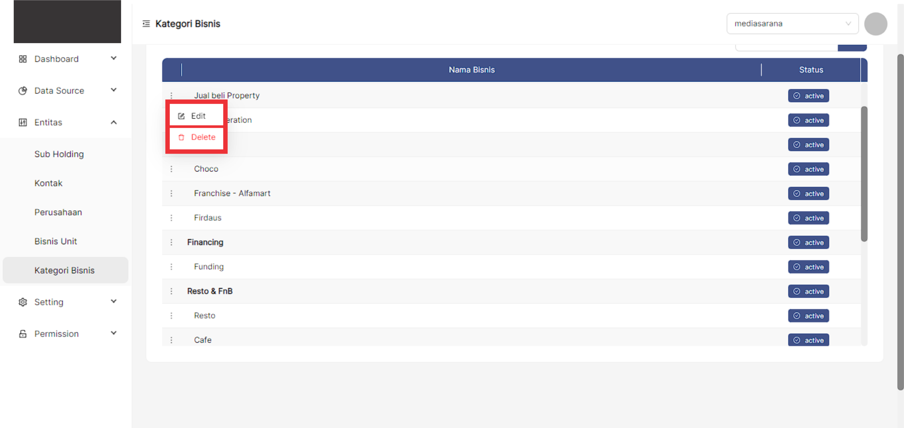
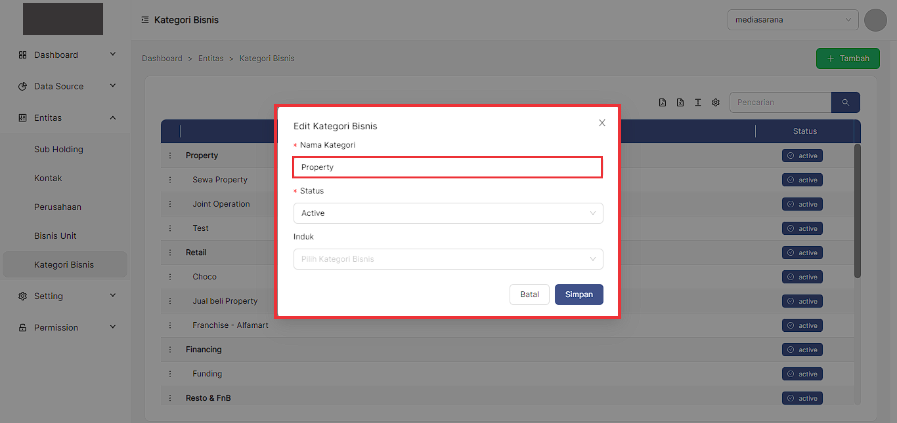
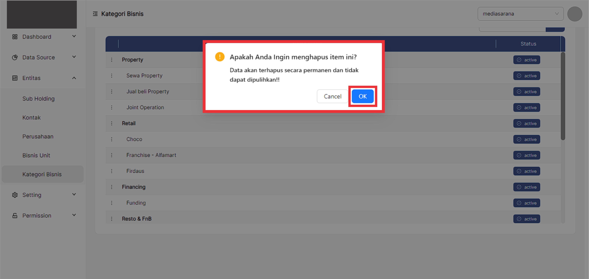
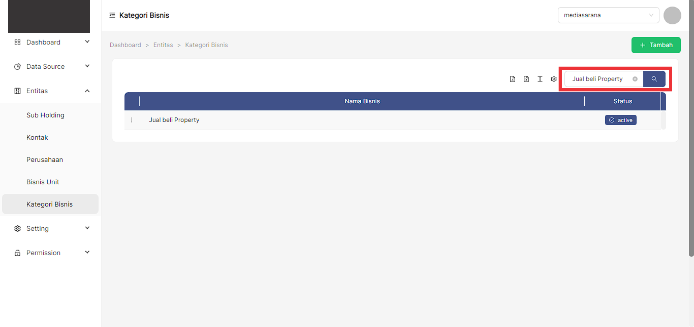
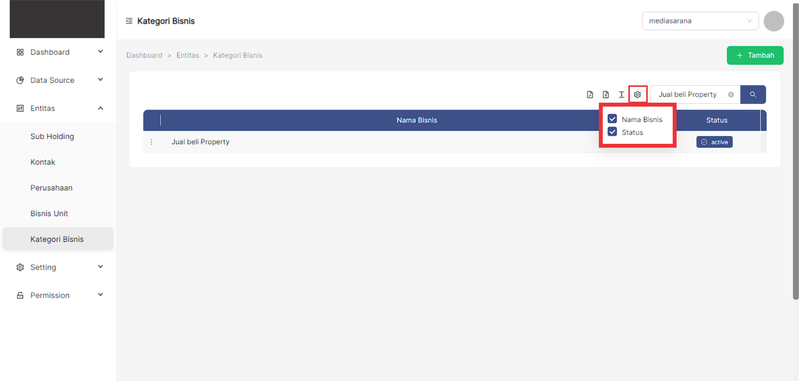
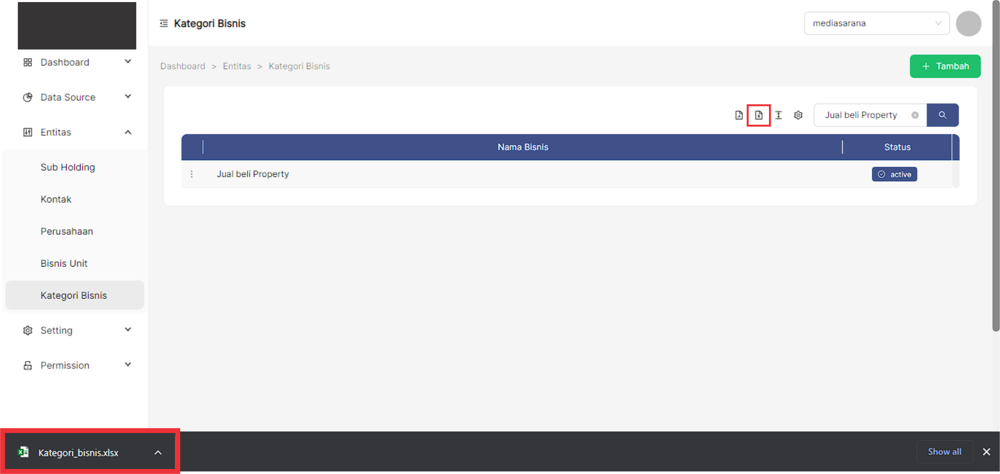
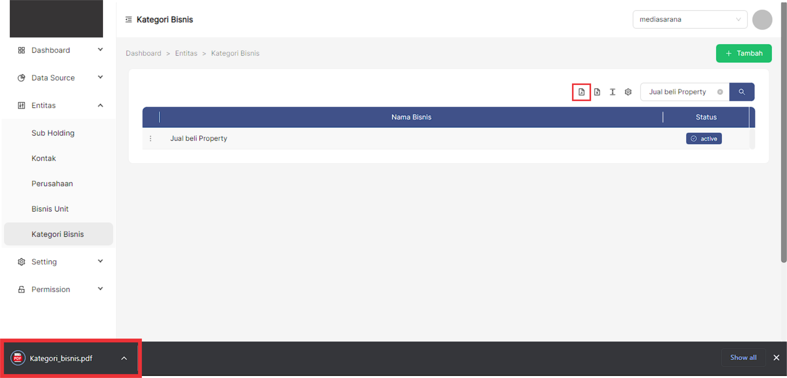

### __Langkah-langkah mengakses menu Kategori Bisnis__
---
1. Buka halaman website dashboard dengan situs https://analytics.ecespro.id

&nbsp;&nbsp;&nbsp;&nbsp;&nbsp;&nbsp;&nbsp;

2. Setelah itu, jika user belum login maka silahkan login terlebih dahulu.

3. Pilih modul Entitas lalu setelah itu pilih menu Kategori Bisnis

### __Langkah-langkah menampilkan data list Kategori Bisnis__
---
1. Setelah kita berhasil mengakses menu Kategori Bisnis maka sistem otomatis akan menampilkan data list Kategori Bisnis.

### __Langkah-langkah entry data Kategori Bisnis__
Fungsi Tambah data berguna untuk membuat entri atau record baru dalam tabel database. 
1. Pilih button **"+ Tambah"** pada bagian kanan atas tabel.

2. Setelah berhasil memilih button **"+ Tambah"** maka sistem akan menampilkan modal pop up yang telah tercantum informasi formulir yang akan di isi oleh user.

3. Masukan nama Kategori Bisnis

4. Pilih status Kategori Bisnis

5. Pada formulir induk terdapat 2 opsi, ketika user memilih induk maka nama Kategori  Bisnis akan termasuk kedalam induk tersebut dan jika user tidak mengisi formulir induk maka nama Kategori Bisnis akan dijadikan Induk Kategori Bisnis.

6. Setelah itu, jika user sudah memastikan formulir Kategori Bisnis telah sesuai maka pilih button **simpan** untuk menyimpan data tersebut dan jika user ingin membatalkan formulir Kategori Bisnis maka pilih button **batal**.

7. Jika data tersebut berhasil **tersimpan** maka sistem akan menampilkan pesan berhasil pada bagian kanan atas tabel.

### __Langkah-langkah edit data Kategori Bisnis__
---
Fungsi Update ini berperan penting dalam memperbarui entri data ketika informasi yang dikandungnya perlu diubah. Dengan fungsi ini user dapat mengubah informasi entri basis data. 
1. Pilih titik 3 pada baris data yang ingin dilakukan perubahan data.

2. Pilih dan klik **Edit**.

3. Setelah memilih edit maka sistem akan menampilkan pop-up modal yang pada setiap formulirnya telah tercantum data terakhir di input.

4. Masukan nama Kategori Bisnis

5. Pilih status Kategori Bisnis

6. Pada formulir induk terdapat 2 opsi, ketika user memilih induk maka nama Kategori  Bisnis akan termasuk kedalam induk tersebut dan jika user tidak mengisi formulir induk maka nama Kategori Bisnis akan dijadikan Induk Kategori Bisnis.

7. Setelah itu, jika user sudah memastikan formulir Kategori Bisnis telah sesuai maka pilih button **simpan** untuk menyimpan data tersebut dan jika user ingin membatalkan formulir Kategori Bisnis maka pilih button **batal**.

8. Jika data tersebut berhasil **tersimpan** maka sistem akan menampilkan pesan data updated pada bagian kanan atas tabel.

### __Langkah-langkah hapus data Kategori Bisnis__
---
Fungsi Hapus data ini berguna untuk menghapus data di database yang sudah tidak diperlukan lagi. Ketika menggunakan fungsi ini, user mengakses detail entri dan kemudian menginstruksikan sistem untuk menghapusnya dari database. 
1. User memilih icon titik 3 pada baris data pada bagian kiri.

2. Pilih dan klik **delete**.

3. Setelah memilih button **hapus** maka sistem akan menampilkan pop-up konfirmasi yang telah tercantum keterangan.

4. Pilih **Ya** jika user ingin menghapus data yang dipilih.

5. Jika data tersebut berhasil **terhapus** maka sistem akan menampilkan pesan record deleted pada bagian kanan atas tabel

### __Langkah-langkah menggunakan fitur-fitur pada tabel Kategori Bisnis__
---
Fitur adalah fitur khusus yang disertakan dalam alat. fitur yang telah tersedia pada Bisnis Unit antara lain, yakni :

1. Fitur pencarian data
Fungsi pencarian data memungkinkan user memfilter data sesuai dengan kriteria.

2. Fitur show/Hide tabel
Fungsi show/hide tabel adalah untuk menampilkan atau menyembunyikan field pada tabel.

3. Fitur ukuran tabel.
Berfungsi untuk mengatur ukuran tabel.

4. Fitur export PDF
Fungsi dari export PDF yaitu untuk mengeluarkan dan menyimpan data supaya dapat di Import kedalam file berbentuk PDF.

5. Fitur export Excel
Fungsi dari export Excel yaitu untuk mengeluarkan dan menyimpan data supaya dapat di Import kedalam file berbentuk Xls.

