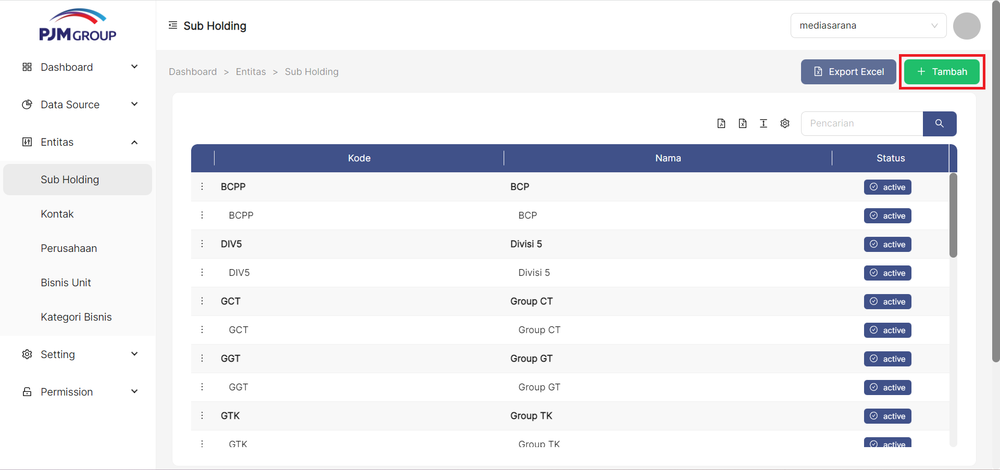
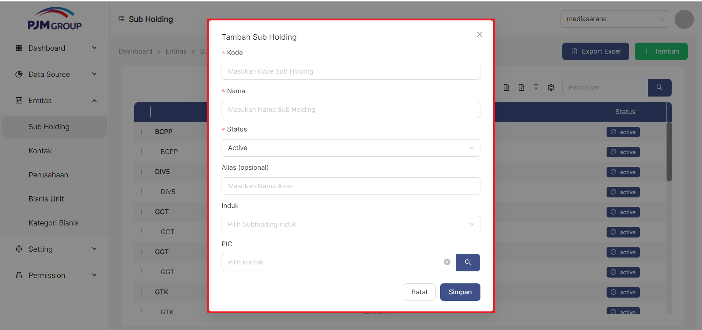

### __Cara Akses__
Entitas->Sub Holding

### __Langkah-langkah Menampilkan Daftar Sub Holding__
---
1. Buka halaman website dashboard dengan situs **https://analytics.ecespro.id**
2. Setelah itu, jika user belum login maka silahkan login terlebih dahulu.
3. Pilih modul Entitas lalu setelah itu pilih menu **Sub Holding**

---
### __Langkah-langkah Menambah Data Sub Holding__

untuk menambahkan item Sub Holding klik tombol "+ Tambah" pada pojok kanan atas tabel

Setelah klik tombol "+ Tambah" pada pojok kanan atas tabel kemudian akan muncul form pop up
1.  Masukan Kode
2.  Masukan Nama Sub Holding
3.  Pilih Status
4.  Masukan Nama Alias (jika ada)
5.  Pilih Induk
6.  Pilih Kontak PIC
7.  Klik tombol Simpan

---
### __Langkah-langkah hapus data Sub Holding__
Fungsi Hapus data ini berguna untuk menghapus di database yang sudah tidak diperlukan lagi ketika menggunakan fungsi ini, user mengakses detail entri dan kemudian mengintruksikan sistem untuk menghapus dari data base.
1. Pilih barisan data dengan meng-klik icon titik tiga pada bagian kiri barisan data.
2. pilih dan klik **delete**.
3. Setelah di klik, sistem akan menampilkan pop-up konfirmasi yang tercantum keterangan bahwa data yang telah terhapus tidak akan bisa dipulihkan kembali.
4. Pilih dan klik **Ok** untuk menghapus data dan pilih **Cancel** untuk membatalkan.
5. Sistem berhasil menghapus data, maka sistem akan menampilkan pesan **Record Deleted** pada bagian kanan atas tabel.

### __Langkah-langkah menggunakan fitur-fitur tabel Sub Holding__
---
Fitur adalah fitur khusus yang disertakan dalam alat, fitur yang telah tersedia pada Sub Holding antara Lain, yakni :

1. Fitur Filter **pencarian data** 
Fungsi pencarian data memungkinkan user memfilter data sesuai dengan kriteria
2. Fitur **show/Hide tabel**
Fungsi show/hide tabel adalah untuk menampilkan atau menyembunyikan field pada tabel.
3. Fitur **Ukuran Tabel**
Berfungsi untuk mengatur ukuran tabel
4. Fitur **Export Excel**
Fungsi dari export excel yaitu untuk mengeluarkan dan menyimpan data supaya dapat di Import kedalam file berbentuk Xls
5. Fitur **Eport PDF**
Fungsi dari export PDF adalah untuk mengeluarkan dan menyimpan data supaya dapat di Import kelama fille berbentuk PDF.