### __Langkah-langkah mengakses menu Kontak__
---
```
1. Buka halaman website dashboard dengan situs **https://analytics.ecespro.id**
```

```
2. Setelah itu, jika user belum login maka silahkan login terlebih dahulu.
```


```
3. Pilih modul Entitas lalu setelah itu pilih menu Kontak.
```
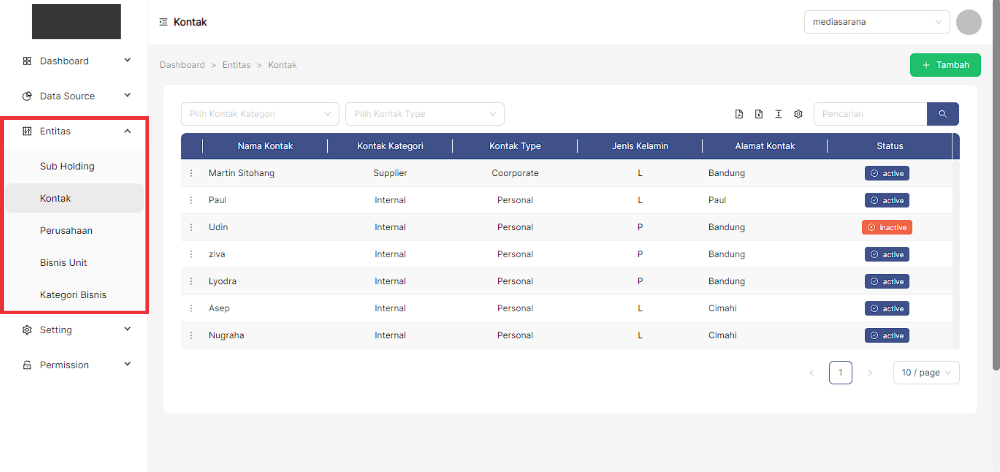


### __Langkah-langkah menampilkan data list Kontak__
---

```
1. Setelah kita berhasil mengakses menu Kontak maka sistem otomatis akan menampilkan data list Kontak.
```


### __Langkah-langkah menambahkan data Kontak__
```
Fungsi Tambah data berguna untuk membuat entri atau record baru dalam tabel database. 
```
```
1. Pilih button **"+ Tambah"** pada bagian kanan atas tabel.
```
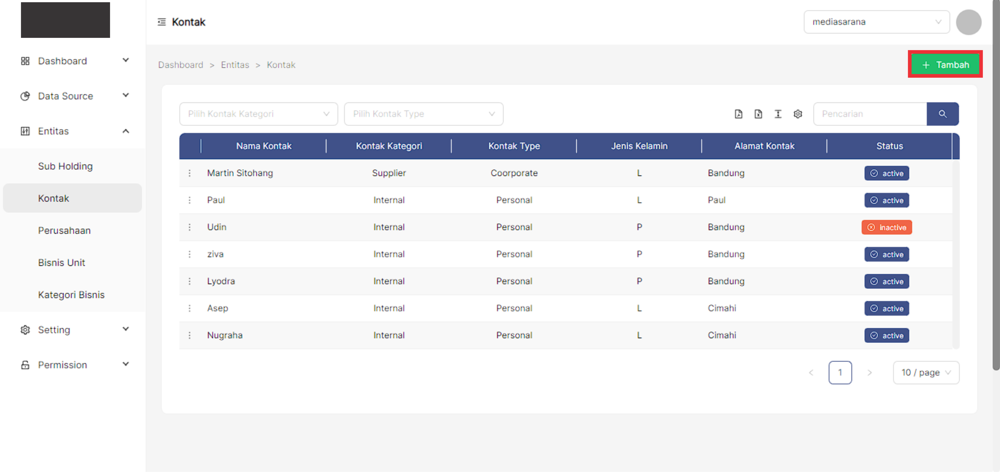
```
2. Setelah berhasil memilih button **"+ Tambah"** maka sistem akan menampilkan modal pop up yang telah tercantum 
informasi formulir yang akan di isi oleh user.
```

```
3. Pilih **Kontak Kategori**
```

```
4. Pilih **Type Kontak**
```
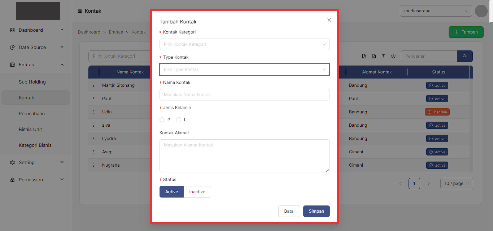
```
5. Masukan **Nama Kontak**
```
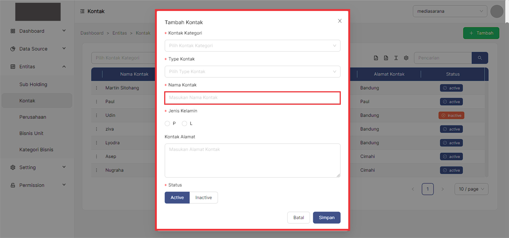
```
6. Pilih **Jenis Kelamin**
```
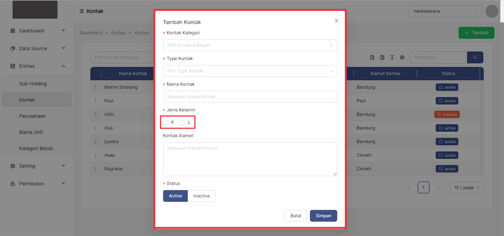
```
7. Masukan **Alamat Kontak**
```
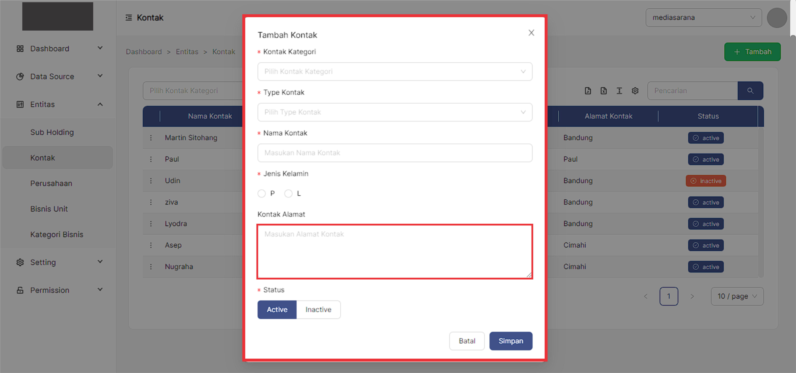
```
8. Pilih **Status**
```

```
9. Setelah itu, jika user sudah memastikan formulir Kontak telah sesuai maka pilih button **simpan** untuk 
menyimpan data tersebut dan jika user ingin membatalkan formulir Kontak maka pilih button **batal**.
```

```
10. Jika data tersebut berhasil **tersimpan** maka sistem akan menampilkan pesan berhasil pada bagian kanan 
atas tabel.
```


### __Langkah-langkah edit data Kontak__
---
```
Fungsi Update ini berperan penting dalam memperbarui entri data ketika informasi yang dikandungnya perlu diubah. 
Dengan fungsi ini user dapat mengubah informasi entri basis data. 
```
```
1. Pilih titik 3 pada baris data yang ingin dilakukan perubahan data.
```
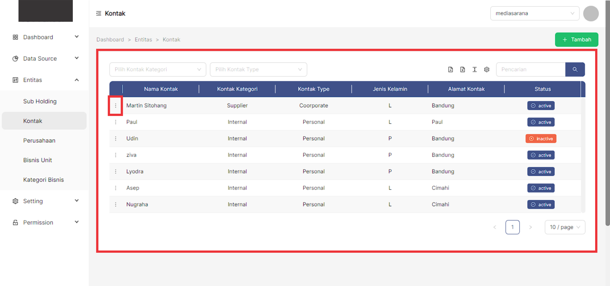
```
2. Pilih dan Klik **Edit**
```
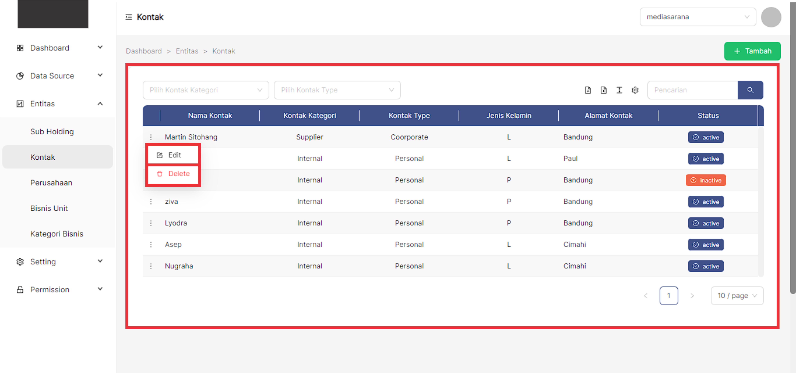
```
3. Setelah memilih edit maka sistem akan menampilkan pop-up modal yang pada setiap formulirnya telah tercantum 
data terakhir di input.
```

```
4. Pilih **Kontak Kategori**
```

```
5. Pilih **Type Kontak**
```
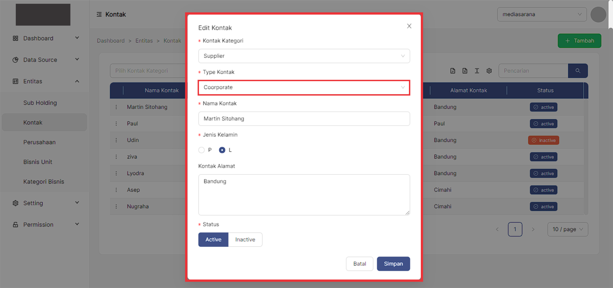
```
6. Masukan **Nama Kontak**
```
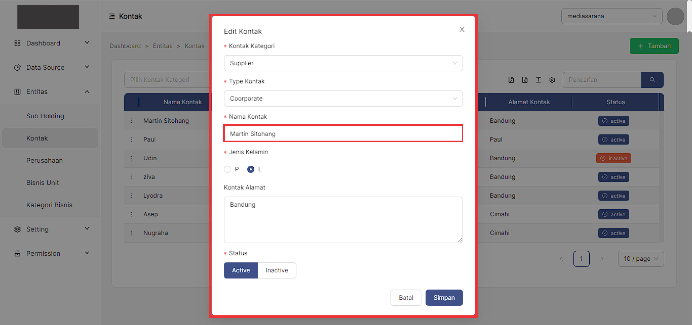
```
7. Pilih **Jenis Kelamin**
```

```
8. Masukan **Alamat Kontak**
```

```
9. Pilih **Status**
```
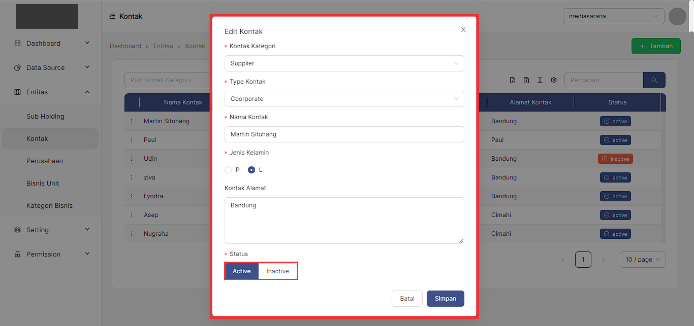
```
10. Setelah itu, jika user sudah memastikan formulir Kontak telah sesuai maka pilih button **Simpan** untuk 
menyimpan data tersebut dan jika user ingin membatalkan formulir Kontak maka pilih button **batal**.
```

```
11. Jika data tersebut berhasil **Tersimpan** maka sistem akan menampilkan pesan **Data Updated** pada bagian 
kanan atas tabel.
```
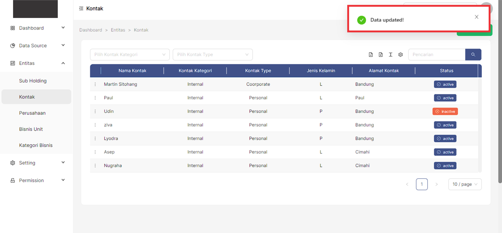


### __Langkah-langkah hapus data Kontak__
---
```
Fungsi Hapus data ini berguna untuk menghapus data di database yang sudah tidak diperlukan lagi. Ketika 
menggunakan fungsi ini, user mengakses detail entri dan kemudian menginstruksikan sistem untuk menghapusnya 
dari database.
```
```
1. User memilih icon titik 3 pada baris data pada bagian kiri.
```

```
2. Pilih dan klik **Delete**.
```

```
3. Setelah memilih button **Hapus** maka sistem akan menampilkan pop-up konfirmasi yang telah tercantum 
keterangan.
```
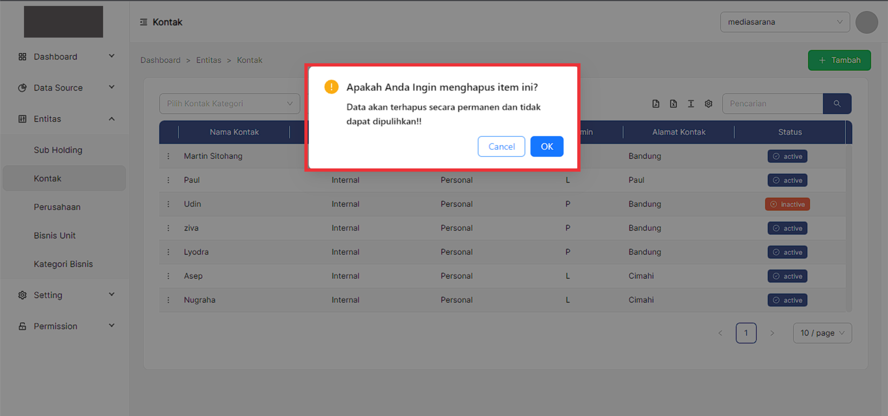
```
4. Pilih **Ok** jika user ingin menghapus data yang dipilih.
```
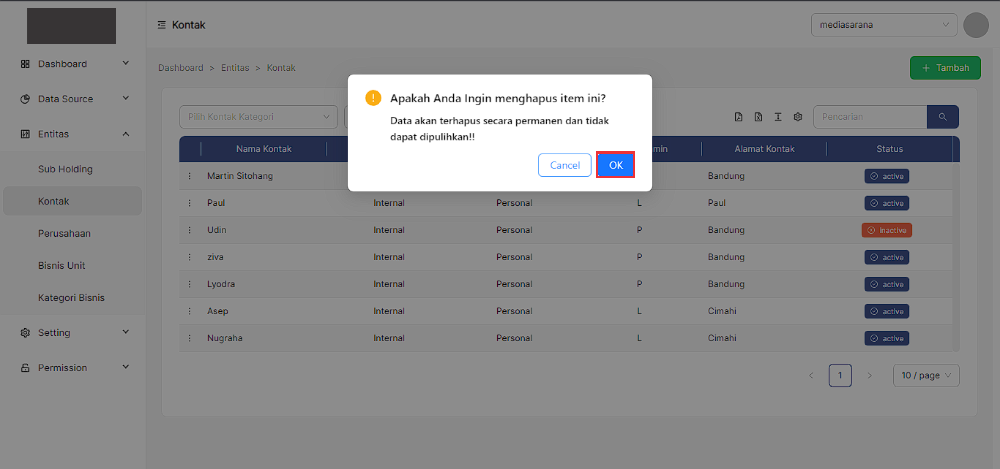
```
5. Jika data tersebut berhasil **Terhapus** maka sistem akan menampilkan pesan **Record Deleted** pada bagian 
kanan atas tabel.
```


### __Fitur-fitur pada tabel Kontak__
---
```
Fitur adalah fitur khusus yang disertakan dalam alat. fitur yang telah tersedia pada Bisnis Unit antara lain, 
yakni :
```
```
1. Fitur filter data Kontak Kategori, fungsi pencarian data memungkinkan user memfilter data sesuai dengan 
kriteria Kontak Kategori.
```
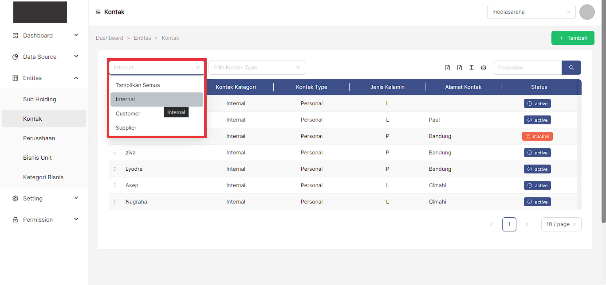
```
2. Fitur pencarian Type Kontak, fungsi pencarian data memungkinkan user memfilter data sesuai dengan kriteria 
Type Kontak.
```

```
3. Fitur pencarian data, fungsi pencarian data memungkinkan user memfilter data sesuai dengan kriteria.
```
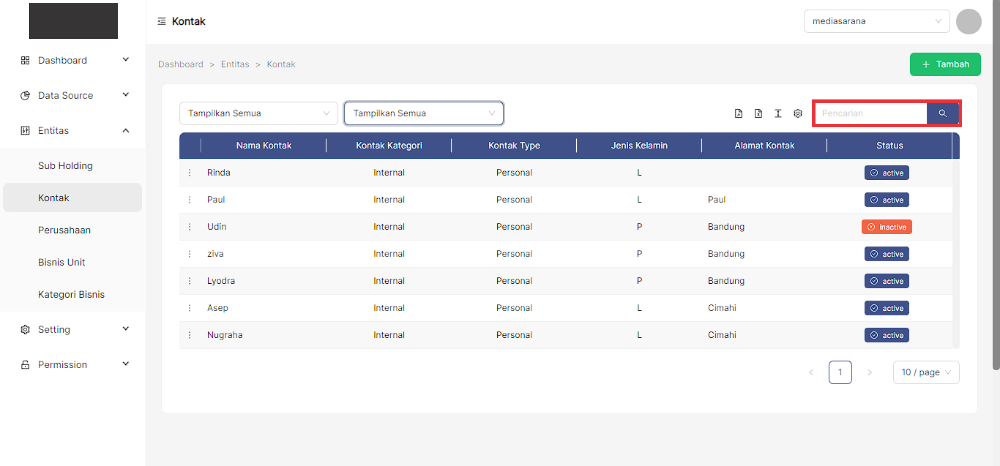
```
4. Fitur show/Hide tabel, fungsi show/hide tabel adalah untuk menampilkan atau menyembunyikan field pada tabel.
```
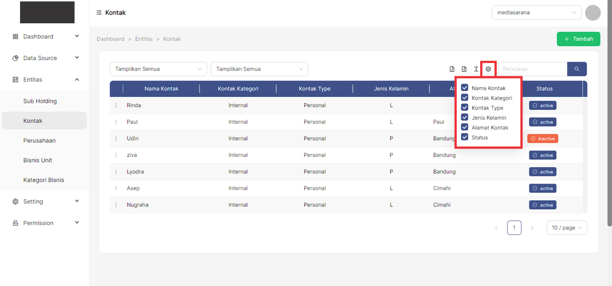
```
5. Fitur ukuran tabel, berfungsi untuk mengatur ukuran tabel.
```
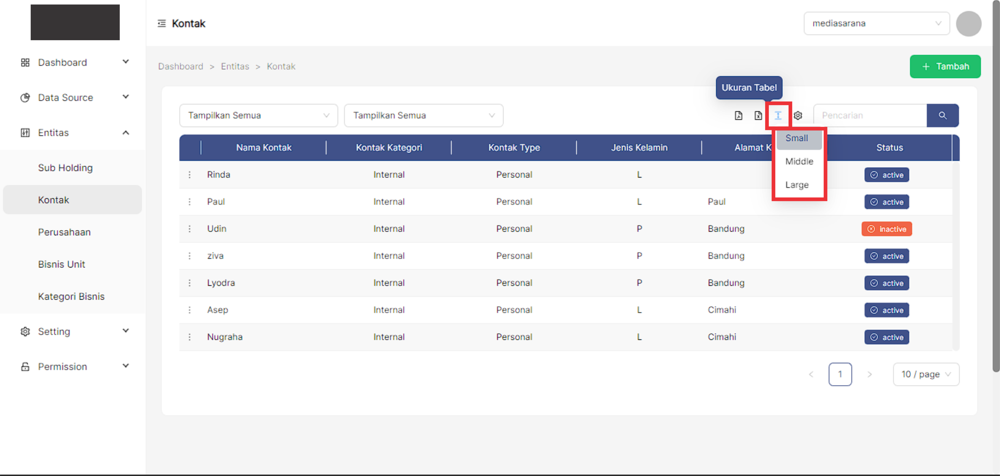
```
6. Fitur export PDF, fungsi dari export PDF yaitu untuk mengeluarkan dan menyimpan data supaya dapat di Import 
kedalam file berbentuk PDF.
```
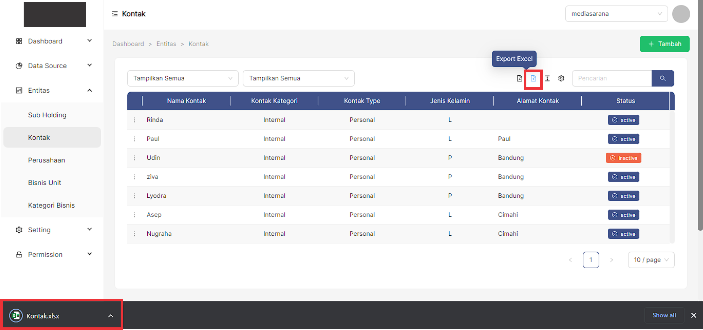
```
7. Fitur export Excel, fungsi dari export Excel yaitu untuk mengeluarkan dan menyimpan data supaya dapat di 
Import kedalam file berbentuk Xls.
```
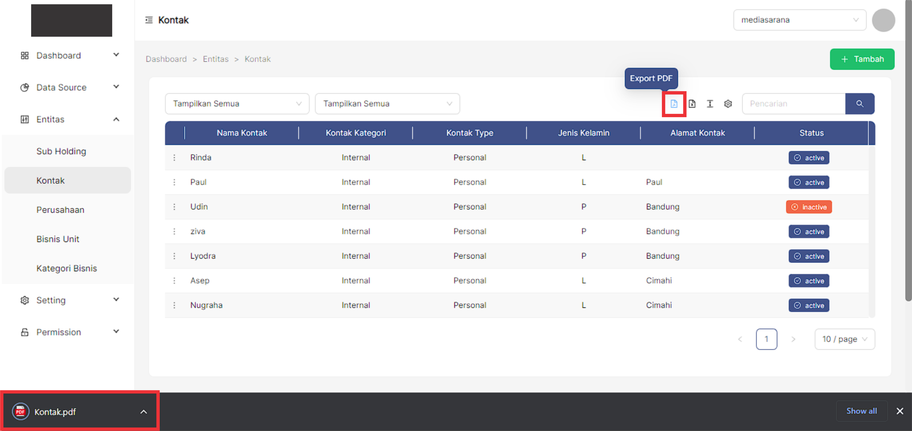


