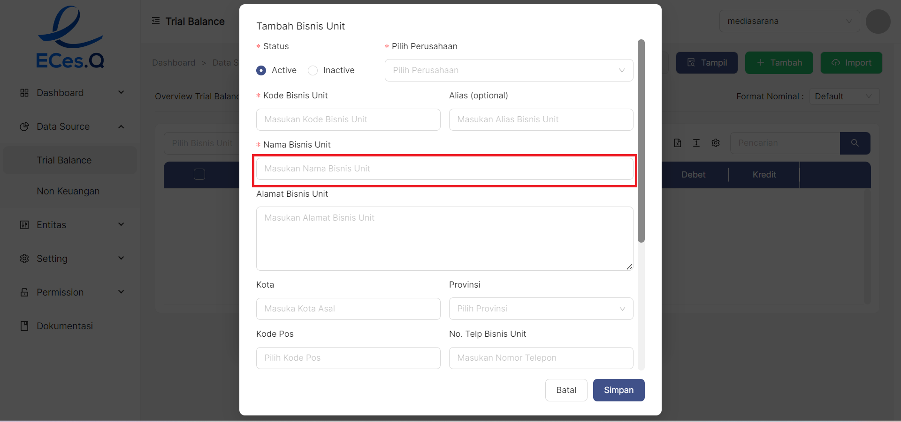

### __Langkah-langkah Akses__

1. Buka halaman website dashboard dengan situs **https://analytics.ecespro.id**

```
https://analytics.ecespro.id
```

2. Setelah itu, jika user belum login maka silahkan login terlebih dahulu.

<br></br><br></br>

3. Pilih modul Data Source lalu setelah itu pilih menu **Trial Balance**

 <br></br><br></br>


---

### __Langkah-langkah Menampilkan Data Overview Trial Balance__

TAB overview Trial Balance berfungsi untuk menampilkan sebagian menu menu yang kita ingin ditampilkan

1. filter periode berfungsi untuk memilih bulan dan tahun yang akan ditampilkan

 <br></br><br></br>

2. Sub Holding 1 pilih yang akan ditampilkan 

 <br></br><br></br>

3. Sub holding 2 pilih yang ingin ditampilkan 

 <br></br><br></br>

4. Perusahaan pilih perusahaan yang akan ingin ditampilkan

 <br></br><br></br>

5. Bisnis Unit pilih yang akan ditampilkan

 <br></br><br></br>

6. jika sudah terisi dan benar ingin itu yang ditampilkan klik tombol terapkan

 <br></br><br></br>

7. fitur tutup filter untuk memperkecil menu overview Trial Balance

 <br></br><br></br>


8. jika sudah diklik tombol terapkan maka tampilan akan muncul di bagian bawah tombol terapkan

 <br></br><br></br>

---

### __Langkah-langkah Menampilkan Data List Trial Balance__


TAB List Trial Balace menampilkan List Trial Balance 
1. Setelah kita berhasil mengakses menu Trial Balance dan memilih tab List Trial Balance maka sistem otomatis akan menampilkan tabel data List Trial Balance.

 <br></br><br></br>

2. Tab List Trial Balance mempunyai filter data yaitu :

* Filter **Periode**.

 <br></br><br></br>


* Filter **Bisnis Unit**.

 <br></br><br></br>

3. Klik **Tampil** untuk menampilkan data pada tabel dan chart.

 <br></br><br></br>


### __Langkah-langkah Menambah Data Trial Balance__
untuk menambahkan item Data List Trial Balance klik tombol __"+ Tambah"__ pada pojok kanan atas tabel

 <br></br><br></br>

Setelah klik tombol "+ Tambah" pada pojok kanan atas tabel kemudian akan muncul form pop up

 <br></br><br></br>

1.  Masukan Bisnis Unit

 <br></br><br></br>

2.  Masukan Tanggal Transaksi

 <br></br><br></br>

3.  Masukan Saldo Awal

 <br></br><br></br>

4.  Masukan Debet

 <br></br><br></br>

5.  Masukan Kredit

 <br></br><br></br>

6.  Pilih Chart of Account

 <br></br><br></br>

7.  Klik tombol Simpan

 <br></br><br></br>

### __Langkah-langkah mengImport List Trial Balance__
untuk MengImport item Data List Trial Balance klik tombol __"Import"__ pada pojok kanan atas tabel

 <br></br><br></br>

Setelah klik tombol "+ Tambah" pada pojok kanan atas tabel kemudian akan muncul form pop up

 <br></br><br></br>

Download template format import

 <br></br><br></br>

1. pilih perusahaan 

 <br></br><br></br>

2. pilih Bisnis Unit

 <br></br><br></br>

3. tombol "+" untuk menambah bisnis Unit

 <br></br><br></br>

```
#### **Step 1 tambah data perusahaan.**
```

```

3.1. Setelah berhasil memilih button **"+ Tambah"** maka sistem akan menampilkan modal pop-up yang telah tercantum 
informasi formulir yang akan di isi oleh user.
```
 <br></br><br></br>

```
3.2. **Langkah pertama** melengkapi formulir data perusahaan, pilih **Status**.
```
 <br></br><br></br>
```
3.3. Pilih **Subholding**,
```
 <br></br><br></br>
```
3.4. Pilih **Kode Perusahaan**.
```
 <br></br><br></br>
```
3.5. Masukan **Alias (opsional)**
```
 <br></br><br></br>
```
3.6. Masukan **Nama Perusahaan**.
```
 <br></br><br></br>
```
3.7. Masukan **Alamat Perusahaan**.
```
 <br></br><br></br>
```
3.8. Masukan **Kota asal Perusahaan**.
```
 <br></br><br></br>
```
3.9. Masukan **Provinsi asal Perusahaan**.
```
 <br></br><br></br>
```
3.10. Masukan **Kode Pos Perusahaan**.
```
 <br></br><br></br>
```
3.11. Masukan nomor **telepon Perusahaan**.
```
 <br></br><br></br>
```
3.12. Masukan **E-mail Perusahaan**.
```
 <br></br><br></br>
```
3.13. Masukan situs **website Perusahaan**.
```
 <br></br><br></br>
```
3.14. Masukan **PIC Perusahaan**.
```
 <br></br><br></br>
```
3.15. Pilih **Kategori Bisnis**.
```
 <br></br><br></br>
```
3.16. Siapkan file berbentuk gambar lalu pilih file tersebut untuk upload atau user bisa melakukan 
**drag dan drop** file.
```
 <br></br><br></br>
```
3.17. Setelah itu, jika user sudah memastikan formulir data Perusahaan telah sesuai maka pilih button 
**Simpan ** untuk menyimpan data tersebut dan melanjutkan ke langkah berikutnya.
```
 <br></br><br></br>


4. pilih Tanggal Transaksi

 <br></br><br></br>

5. Upload File berfungsi untuk mengupload dari file di laptop kita

 <br></br><br></br>

6. klik tombol simpan

 <br></br><br></br>

### Langkah-langkah Delete List Trial Balance
untuk mendelete List Trial Balance  klik tombol titik tiga dipojok bagian kiri disetiap tabel

 <br></br><br></br>

1. klik tombol titik tiga dipojok kiri disetiap tabel

 <br></br><br></br>

2. pilih Delete

 <br></br><br></br>


3. jika benar benar ingin menghapus bagian tabel tersebut akan muncul tampilan Cancel atau Ok 

 <br></br><br></br>


4. jika ingin menghapus nya maka klik tombol Ok


 <br></br><br></br>

5. jika tidak jadi menghapusnya maka klik tombol cancel

 <br></br><br></br>

---

### __Langkah-langkah menggunakan fitur-fitur tabel Trial Balance__
---
Fitur adalah fitur khusus yang disertakan dalam alat, fitur yang telah tersedia pada Trial Balance antara Lain, yakni :

1. Fitur Filter **pencarian data** 

Fungsi pencarian data memungkinkan user memfilter data sesuai dengan kriteria

<br></br><br></br>

2. Fitur **show/Hide tabel**

Fungsi show/hide tabel adalah untuk menampilkan atau menyembunyikan field pada tabel.

<br></br><br></br>

3. Fitur **Ukuran Tabel**

Berfungsi untuk mengatur ukuran tabel

<br></br><br></br>

4. Fitur **Export Excel**

Fungsi dari export excel yaitu untuk mengeluarkan dan menyimpan data supaya dapat di Import kedalam file 
berbentuk Xls

<br></br><br></br>

5. Fitur **Eport PDF**

Fungsi dari export PDF adalah untuk mengeluarkan dan menyimpan data supaya dapat di Import kelama fille berbentuk PDF.

<br></br><br></br>