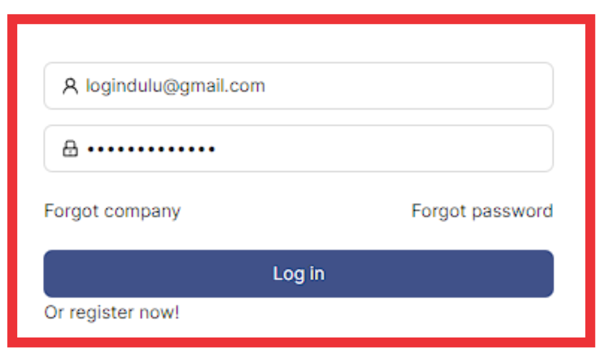
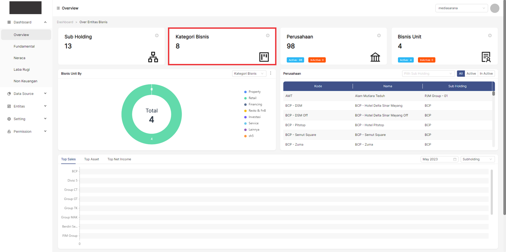
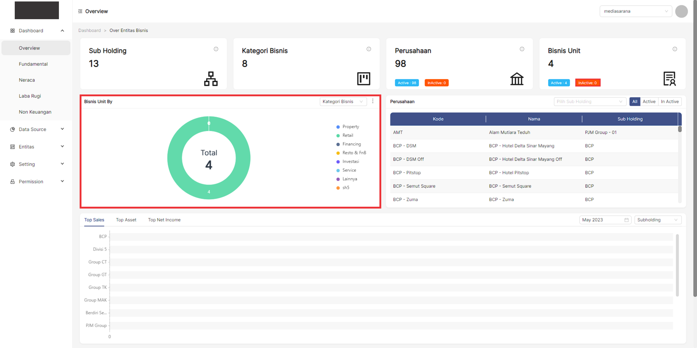
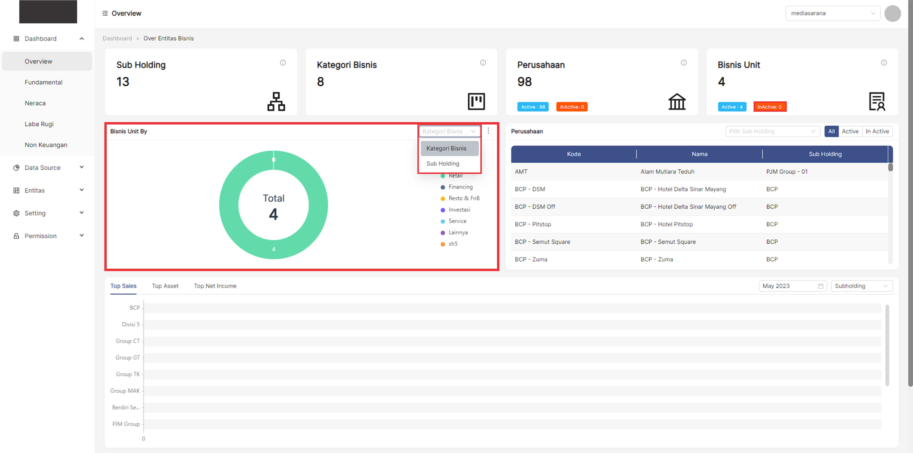
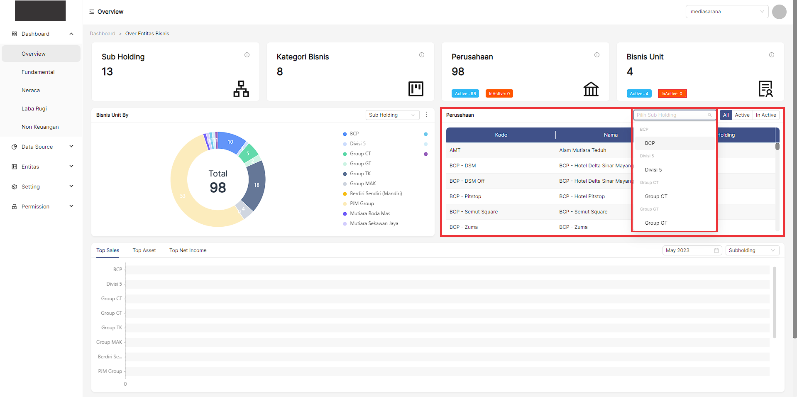
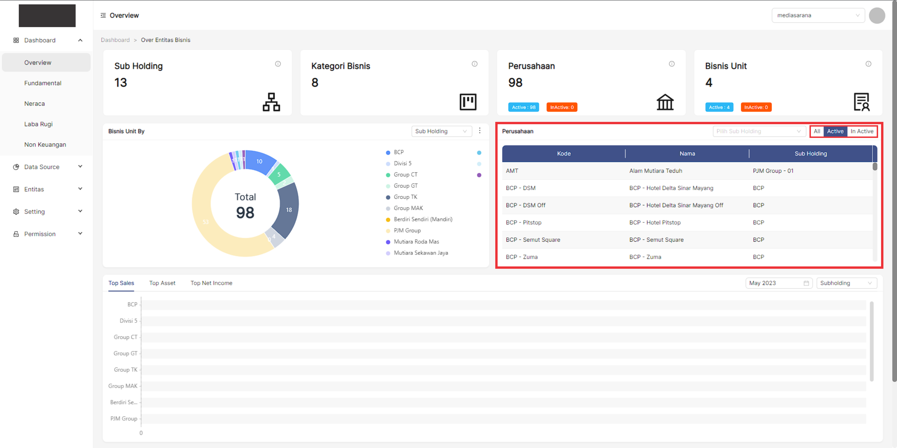

Menu **Overview Entitas**, adalah rangkuman informasi yang akan disampaikan kedalam bentuk data dan grafik.

---
### __Langkah-langkah mengakses menu Overview Entitas__
---
1. Buka halaman website dashboard dengan situs **https://analytics.ecespro.id**
  

2. Setelah itu, jika user belum login maka silahkan login terlebih dahulu.  

    

3. Setelah berhasil login, maka sistem akan secara otomatis menavigasi ke halaman **Overview Entitas**  

## __Overview__
### __Overview Subholding__
---
**Subholding** bertindak sebagai promotor keunggulan operasional dengan mengembangkan skala ekonomi dan keuntungan sinergis dari masing-masing perusahaan.
Subholding juga mempercepat pengembangan bisnis dan kapabilitas bisnis yang ada, meningkatkan kesiapan dan fleksibilitas untuk kemitraan dan pembiayaan yang lebih menguntungkan bagi perusahaan. 
* Pada data tersebut terdapat 13 **Subholding** pada sistem informasi dashboard.     

### __Overview Kategori Bisnis__
---
**Kategori Bisnis** adalah suatu kriteria bidang yang dipilih untuk mengembangkan sebuah bisnis, contohnya adalah bisnis property, food and beverages, franchise, dan lain-lain. 
* Pada data tersebut terdapat 18 **Kategori Bisnis** yang tercantum  pada sistem informasi dashboard.    

### __Overview Perusahaan__
**Menurut Pasal 1 Huruf b UU No. 3 Tahun 1982**, perusahaan adalah setiap bentuk usaha yang bersifat tetap dan terus menerus dan didirikan, bekerja serta berkedudukan dalam wilayah Republik Indonesia untuk tujuan memperoleh keuntungan atau laba.

* Pada data tersebut terdapat 98 Perusahaan yang tertera pada overview perusahaan.    
    

* Terdapat sebuah informasi data bahwa terdapat 98 Perusahaan aktif.    
    

* Lalu, terdapat sebuah informasi data bahwa terdapat 0 perusahaan yang tidak aktif.    

### __Overview Bisnis Unit__
---
**Bisnis Unit** adalah unit yang menghasilkan produk atau layanan untuk kelompok pelanggan tertentu. Bisnis Unit  biasanya merupakan unit terpisah dan perusahaan mungkin memiliki beberapa Bisnis Unit . 
* Pada data tersebut terdapat 4 Bisnis Unit yang tertera pada overview perusahaan.

    

* Terdapat sebuah informasi data bahwa terdapat 4 Bisnis Unit aktif.

    

* Lalu, terdapat sebuah informasi data bahwa terdapat 0 Bisnis Unit yang tidak aktif.

    

### __Overview grafik Bisnis Unit By__
---
Bisnis Unit By akan menampilkan informasi data berupa grafik. Terdapat 2 Kriteria yaitu Kategori Bisnis dan Subholding.

     

 1. Jika user ingin melihat grafik data kategori bisnis maka user memilih dan mengklik filter pada bagian kanan atas dengan kriteria kategori bisnis.

      

2. Maka sistem akan menampilkan data sesuai yang dipilih.

     

3. Lalu, jika user ingin melihat grafik data subholding maka user memilih dan mengklik filter pada bagian kanan atas dengan kriteria subholding.

     

4. Maka sistem akan menampilkan data sesuai yang dipilih.

     

### __Overview tabel Perusahaan__
---
Pada overview tabel perusahaan tercantum sebuah informasi data mengenai data suatu perusahaan.

     

1. Terdapat filter subholding pada tabel perusahaan pada bagian kanan atas dengan beberapa kriteria jika user memilih maka sistem akan menampilkan data pada tabel sesuai kriteria yang dipilih.

     

2. Terdapat filter button pada tabel perusahaan, antara lain yaitu. 

     
*   **All**
Ketika user memilih filter all maka sistem akan menampilkan seluruh data.

     

*   **Active**
Lalu, ketika user memilih filter active maka sistem akan menampilkan data perusahaan yang active.

     

*   **Inactive**
Dan ketika user memilih filter inactive maka sistem akan menampilkan data perusahaan yang inactive.

     

### __Overview entity overview__
---
Tedapat 3 entity overview, yakni :
* **Entity Top Sales**

     

* **Entity Top Asset**

     

* **Entity Top Net Income**

     

