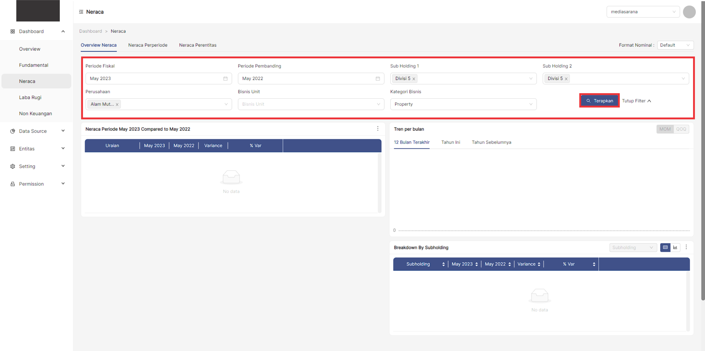

## __Langkah-langkah mengakses menu Laba Rugi__
---
1. Buka halaman website dashboard dengan situs **https://analytics.ecespro.id**

&nbsp;&nbsp;&nbsp;&nbsp;&nbsp;&nbsp;&nbsp;

2. Setelah itu, jika user belum login maka silahkan login terlebih dahulu.

3. Setelah berhasil login, maka sistem akan secara otomatis menavigasi ke halaman **Laba Rugi**

## __Langkah-langkah menampilkan list data Laba Rugi__
---
1. Ketika user memilih menu Neraca maka sistem akan menampilkan informasi data Neraca yang terdiri dari :
*  Filter data
*  Neraca Periode
*  Tren Per Bulan
*  Breakdown By Subholding 

2. Sebelum ingin menampilkan data user harus mengisi filter data terlebih dahulu untuk menampilkan data Neraca.
   * Filter Periode Fiskal
   * Filter Periode Pembanding

   * Ketika mengklik kollapse pada filter lainnya maka sistem akan menampilkan beberapa filter data lainnya.
   * Filter Subholding 1
   * Filter Subholding 2
   * Filter Perusahaan
   * Filter Bisnis Unit
   * Filter Kategori Bisnis
3. Jika filter telah dilengkapi oleh user maka user bisa melanjutkannya dengan memilih klik **Terapkan**

4. Setelah user memilih klik **Terapkan**, maka sistem akan Menampilkan beberapa data, jika terdapat informasi data maka sistem akan menampilkan data pada tabel namun jika tidak ada informasi data didalamnya maka sistem tidak akan menampilkan informasi data. Terdapat informasi data yang akan tampil jika user memilih klik **Terapkan**, Yakni :
   * Tabel Neraca Periode. Terdapat icon titik tiga Pada bagian kanan atas tabel dimana user dapat melakukan export data dalam bentuk PDF dan Excel.

   * Tren Per Bulan, didalam tren perbulan terdapat beberapa sub menu lagi, yakni :
     * 12 Bulan Terakhir
     * Tahun Ini
     * Tahun Sebelumnya
   * Breakdown By Subholding, sistem akan menampilkan data berbentuk tabel jika data tersedia. User juga dapat merubah data ke dalam bentuk grafik pada bagian kanan atas tabel serta user dapat melakukan filter data namun filter data akan aktif jika telah ada data yang terdaftar.
    * Terdapat icon titik tiga Pada bagian kanan atas tabel dimana user dapat melakukan export data dalam bentuk PDF dan Excel.

### __Overview Laba Rugi__
### __Laba Rugi Perperiode__
### __Laba Rugi Parentitas__