### __Langkah-langkah mengakses menu Access Control__
---
1. Buka halaman website dashboard dengan situs https://analytics.ecespro.id
```
https://analytics.ecespro.id
```


2. Setelah itu, jika user belum login maka silahkan login terlebih dahulu.

<br></br><br></br>

3. Pilih modul Permisions lalu setelah itu pilih menu Access Control

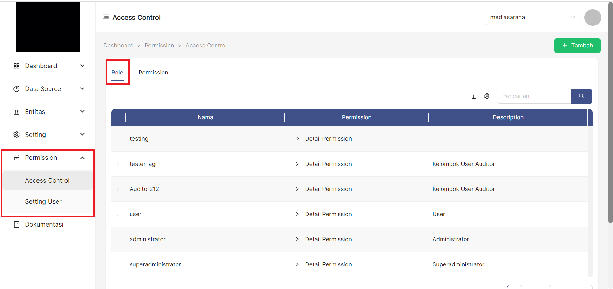<br></br><br></br>

### __Langkah-langkah menampilkan data list Access Control Tab Role__
---
1. Setelah kita berhasil mengakses menu Access Control maka sistem otomatis akan menampilkan list data pada Tab Role.

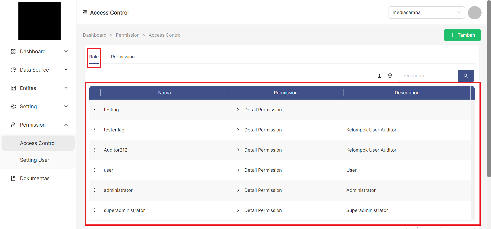<br></br><br></br>
<!-- 
### __Langkah-langkah menambahkan data Access Control dalam tab Permision__
---
Fungsi Tambah data berguna untuk membuat entri atau record baru dalam tabel database.

1. Pilih button **"+ Tambah"** pada bagian kanan atas tabel.

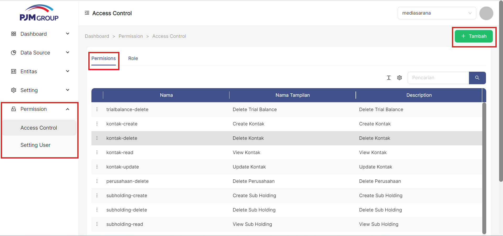<br></br><br></br>

2. Setelah berhasil memilih button **"+ Tambah"** maka sistem akan tercantum informasi formulis yang akan di isi oleh user.
3. User **wajib** mengisi folmulir **Access Control** agar bisa lanjut ke langkah berikutnya.
4. **Langkah pertama** melengkapi folmulir data Access Control pada tab Permision.
5. Masukan **Nama**
6. pilih **Hak Akses**
7. Setelah itu, jika user sudah memastikan formulir Access Control Tab Permision telah sesuai maka pilih button **Simpan** untuk menyimpan data tersebut dan jika user ingin membatalkan formulir kontak maka pilih button **batal**.
8. Jika data tersebut berhasil **tersimpan** maka sistem akan menampilkan pesan berhasil pada bagian kanan atas tabel.


### __Langkah-langkah menggunakan fitur-fitur pada tabel Access Control pada tab Permision__
---
Fitur adalah fitur khusus yang disertakan dalam alat. Fitur yang tersedia pada Access Control Tab Permisison, yakni :
1. Fitur **Show/Hide tabel**

Fungsi show/hide tabel adalah untuk menampilkan atau menyembunyikan field pada tabel.

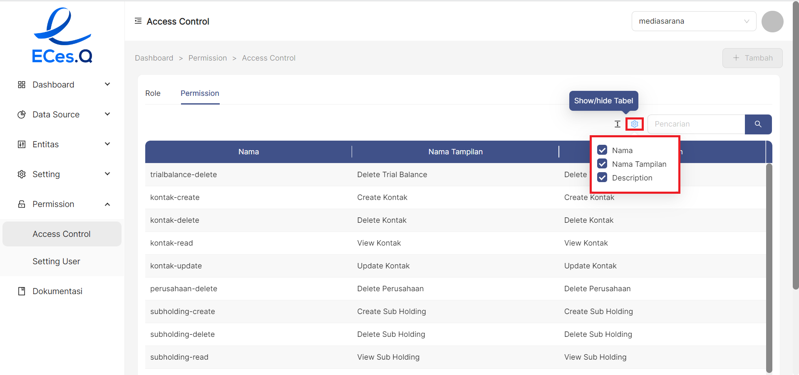<br></br><br></br>

2. Fitur **Ukuran tabel**

Berfungsi untuk mengatur ukuran tabel.

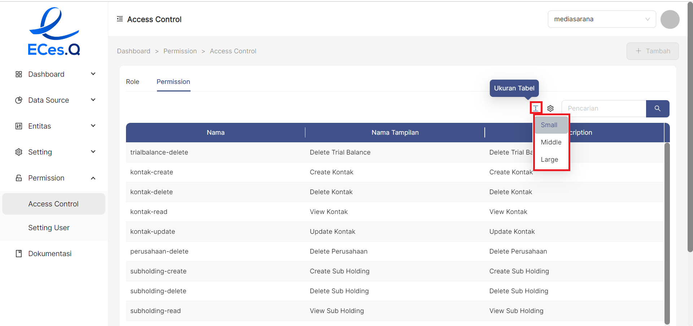<br></br><br></br>

3. Fitur pencarian data, fungsi pencarian data memungkinkan user memfilter data sesuai dengan kriteria.

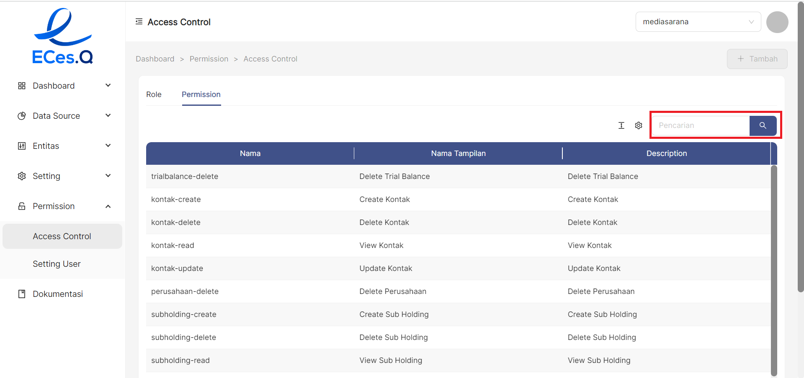<br></br><br></br>

### __Langkah-langkah edit data Access Control tab Permision__
---
Fungsi Update ini berperan penting dalam mempengaruhi entri data ketik informasi yang dikandungnya perlu diubah. Dengan fungsi ini user dapat mengubah informasi entri basis data.

1. Pilih baris data dengan meng-klik icon titik tiga pada bagian kiri barisan tabel.

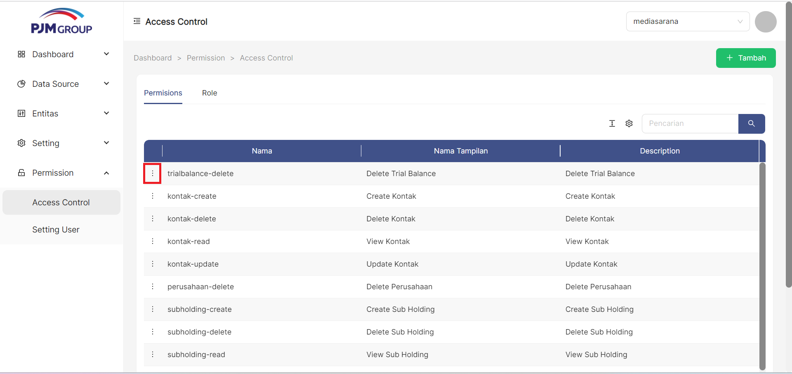<br></br><br></br>

2. pilih **edit**

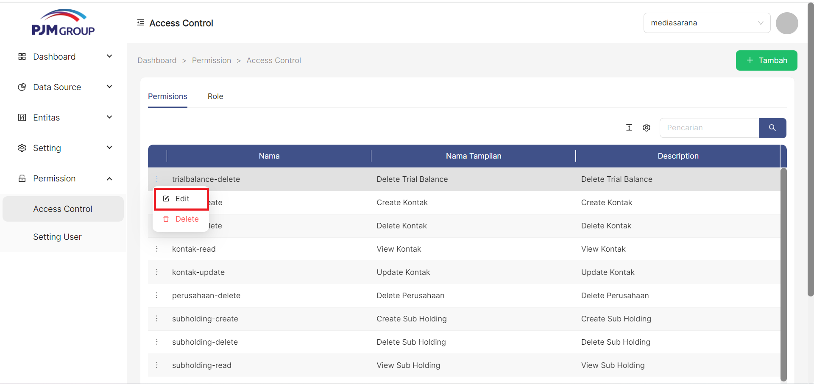<br></br><br></br>

3. Setelah user memilih edit, maka sistem akan menampilkan modal pop-up yang telah tercantum informasi formulir yang akan di ubah oleh user.

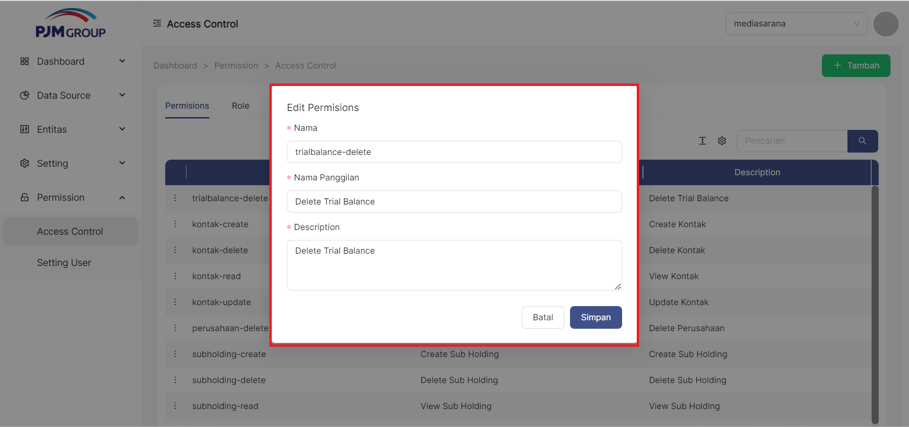<br></br><br></br>

4. Masukan **Nama**.

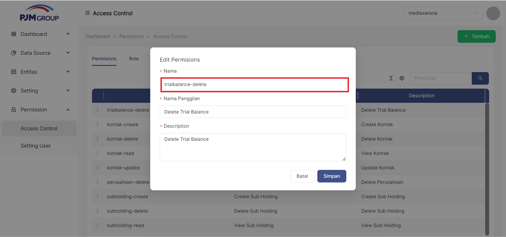<br></br><br></br>

5. Masukan **Nama Panggilan**.

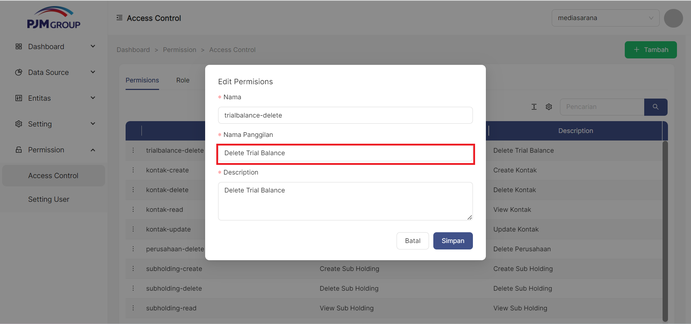<br></br><br></br>

6. Masukan **Description**

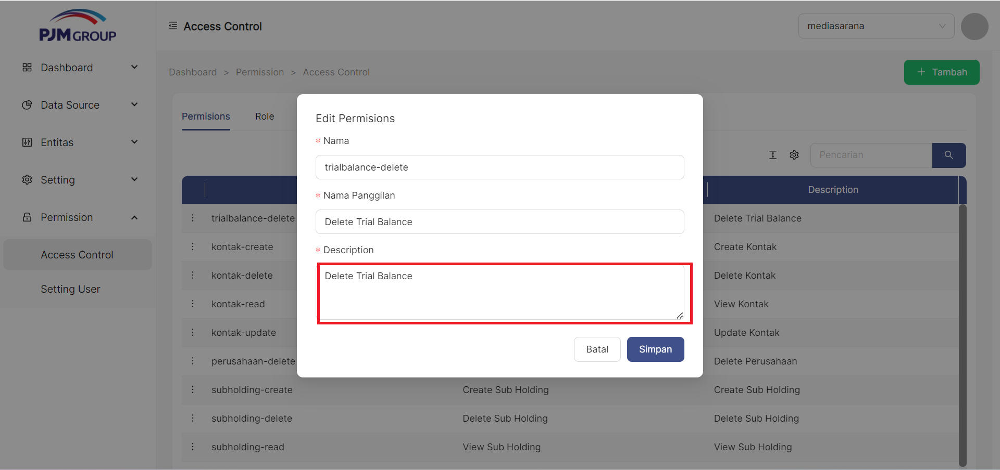<br></br><br></br>

7. Setelah itu, jika user sudah memastikan formulir Edit Permision telah sesuai maka pilih button **simpan** untuk menyimpan data tersebut dan jika user ingin membatalkan Edit Permision maka pilih button **batal**.

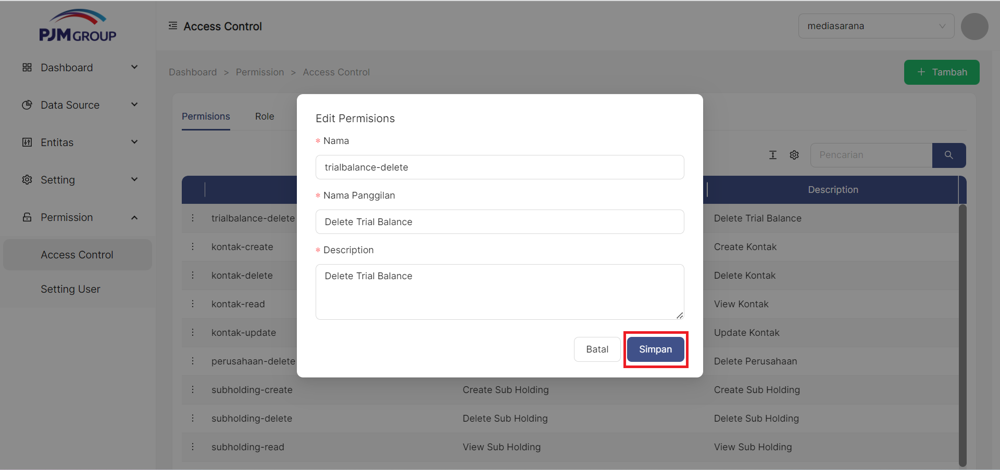<br></br><br></br>

8. jika data tersebut berhasil di edit dan berhasil disimpan maka sistem akan menampilkan pesan berhasil diedit pada bagian kanan atas tabel.


### __Langkah-langkah hapus data Access Control tab Permision__
---
Fungsi Hapus data ini berguna untuk menghapus data di database yang sudah tidak diperlukan lagi, ketika menggunakan fungsi ini, user mengakses detail entri dan kemudian mengintruksikan sistem untuk menghapus dari database.

1. Pilih baris data dengan meng-klik icon titik tiga pada bagian kiri baris data.

<br></br><br></br>

2. pilih dan klik **delete**.

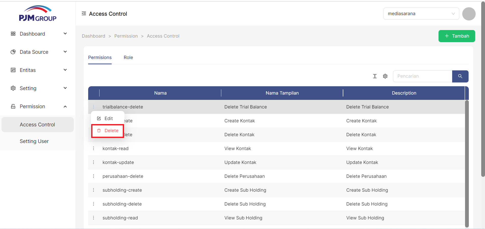<br></br><br></br>

3. Setelah di klik, sistem akan menampilkan po-up konfirmasi yang tercantum keterangan bahwa data yang telah dihapus tidak akan bisa dipulihkan kembali.

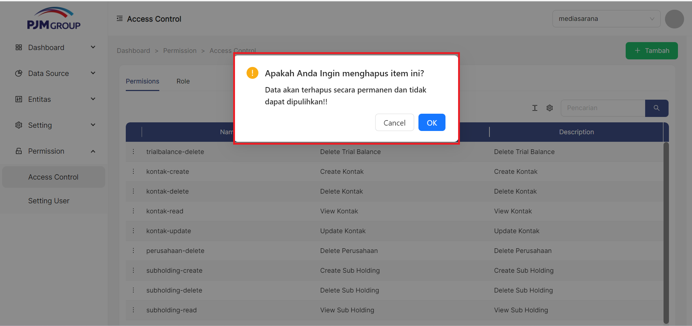<br></br><br></br>

4. Pilih dan klik **Ok** untuk menghapus data dan pilih **Cancel** untuk membatalkan.

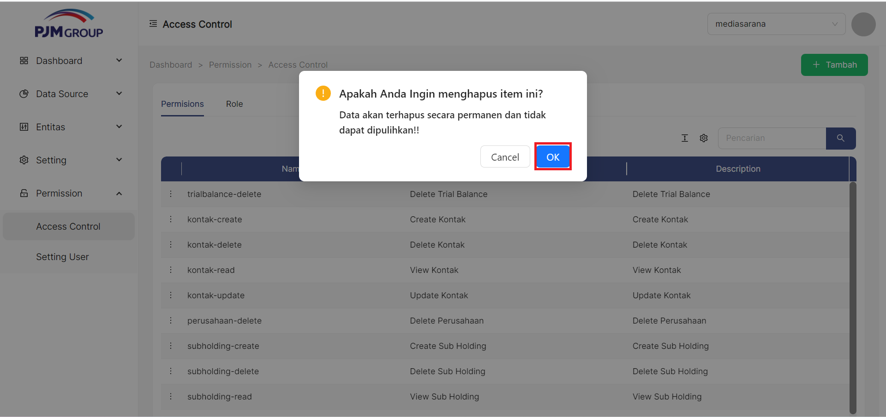<br></br><br></br>

5. Setelah berhasil menghapus data, maka sistem akan menampilkan pesan **Record Delete** pada bagian kanan atas tabel. -->

<!-- TAB Role -->

### __Langkah-langkah menambahkan data Access Control dalam tab Role__
---
Fungsi Tambah data berguna untuk membuat entri atau record baru dalam tabel database.

1. Pilih button **"+ Tambah"** pada bagian kanan atas tabel.

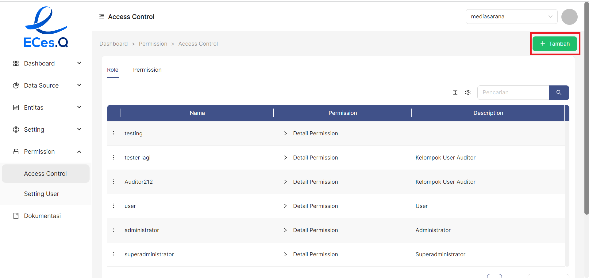<br></br><br></br>

2. Setelah berhasil memilih button **"+ Tambah"** maka sistem akan tercantum informasi formulis yang akan di isi oleh user.


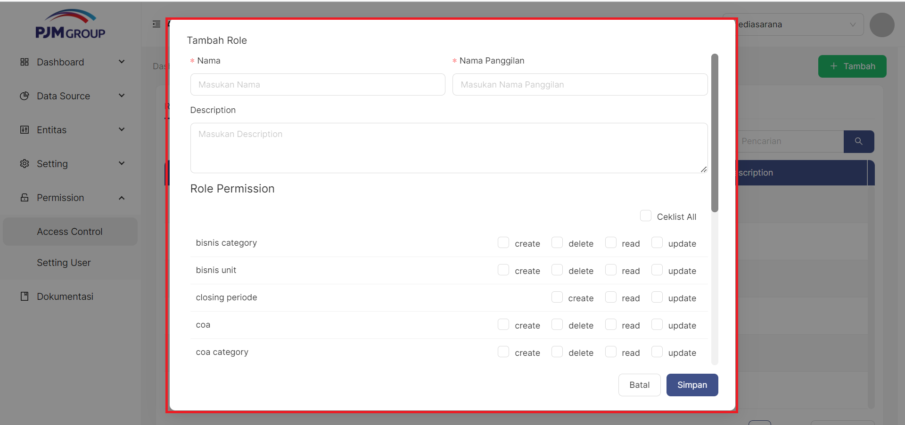<br></br><br></br>


3. Masukan **Nama**

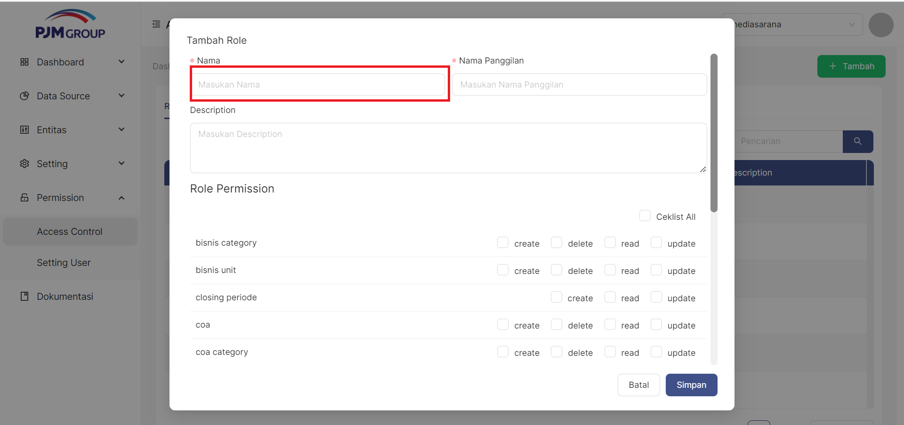<br></br><br></br>

4. Masukan **Nama Panggilan**

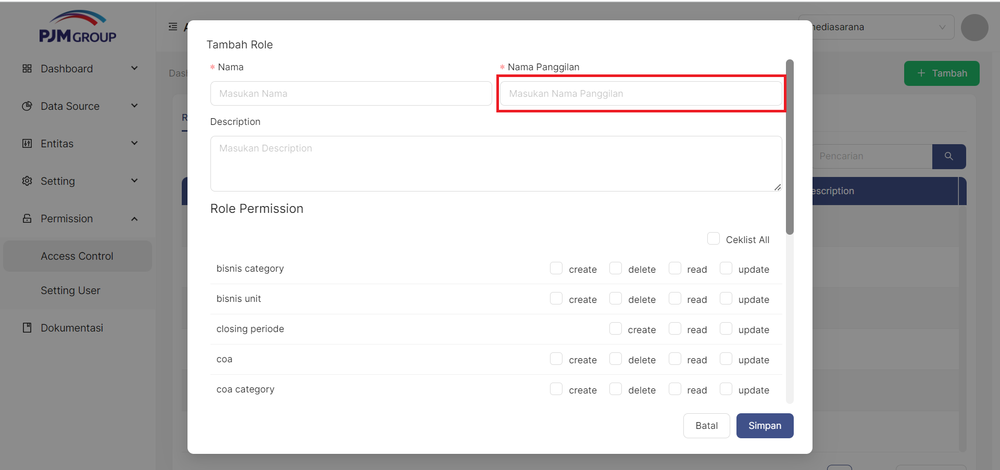<br></br><br></br>

5. Masukan **Deskripsi**

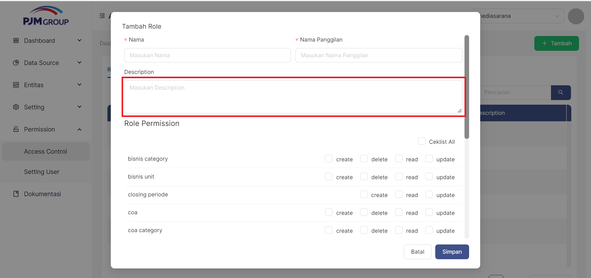<br></br><br></br>

6. pilih **Role Permission**

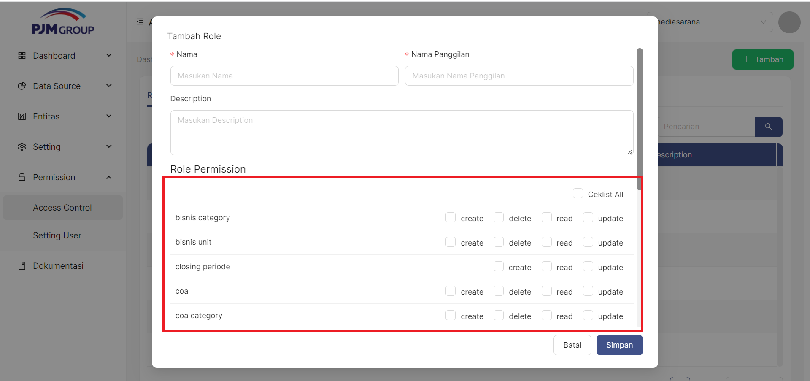<br></br><br></br>

7. Setelah itu, jika user sudah memastikan formulir Access Control Tab Role telah sesuai maka pilih button **Simpan** untuk menyimpan data tersebut dan jika user ingin membatalkan formulir kontak maka pilih button **batal**.

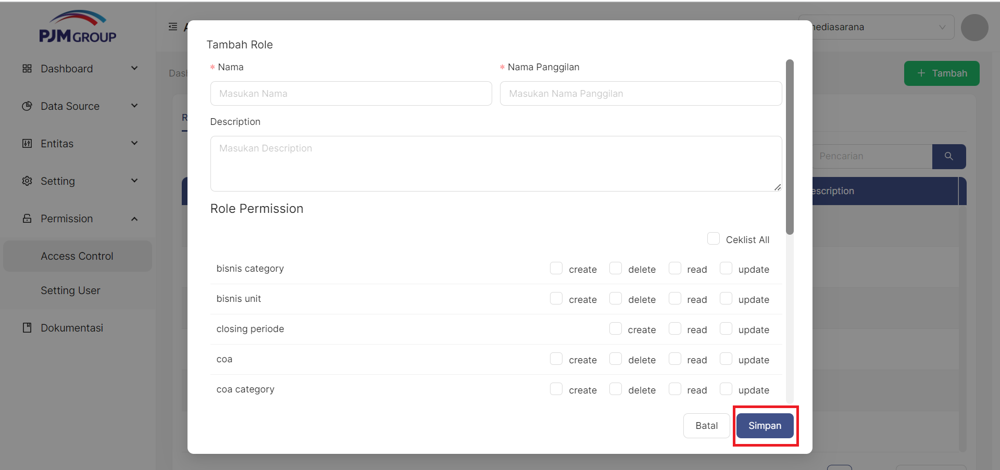<br></br><br></br>

8. Jika data tersebut berhasil **tersimpan** maka sistem akan menampilkan pesan berhasil pada bagian kanan atas tabel.

---

### __Langkah-langkah edit data Access Control tab Role__

Fungsi Update ini berperan penting dalam mempengaruhi entri data ketik informasi yang dikandungnya perlu diubah. Dengan fungsi ini user dapat mengubah informasi entri basis data.

1. Pilih baris data dengan meng-klik icon titik tiga pada bagian kiri barisan tabel.

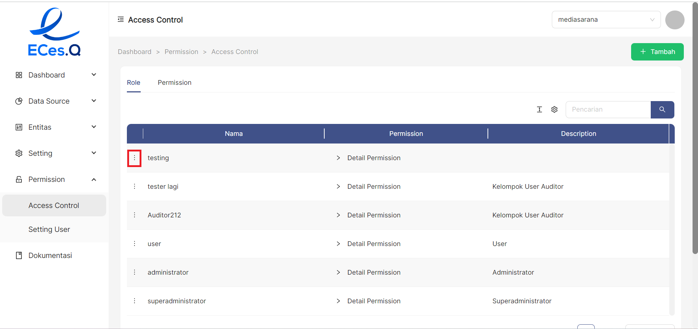<br></br><br></br>

2. pilih **edit**

<br></br><br></br>

3. Setelah user memilih edit, maka sistem akan menampilkan modal pop-up yang telah tercantum informasi formulir yang akan di ubah oleh user.

<br></br><br></br>

3. Masukan **Nama**

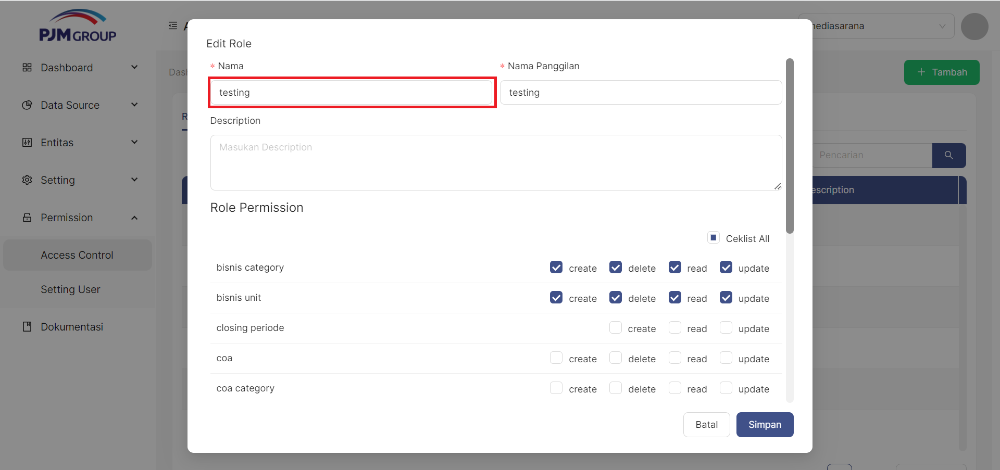<br></br><br></br>

4. Masukan **Nama Panggilan**

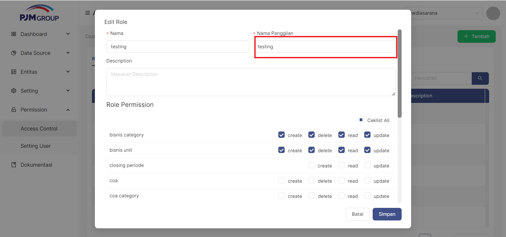<br></br><br></br>

5. Masukan **Deskripsi**

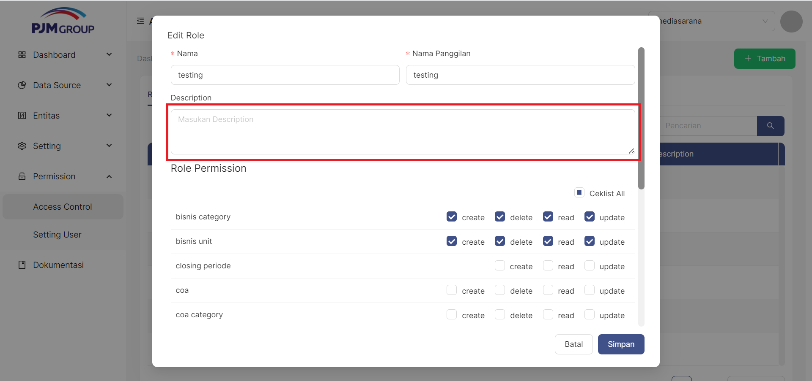<br></br><br></br>

6. pilih **formula**

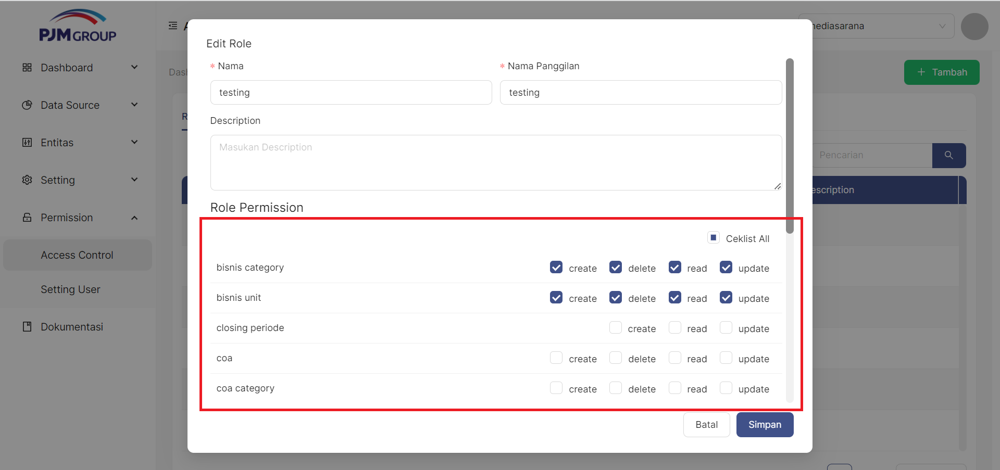<br></br><br></br>

7. Setelah itu, jika user sudah memastikan formulir Access Control Tab Role telah sesuai maka pilih button **Simpan** untuk menyimpan data tersebut dan jika user ingin membatalkan formulir kontak maka pilih button **batal**.

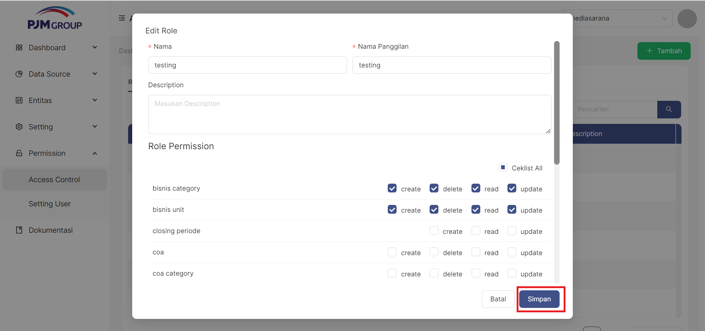<br></br><br></br>

---

### __Langkah-langkah hapus data Access Control tab Role__
---
Fungsi Hapus data ini berguna untuk menghapus data di database yang sudah tidak diperlukan lagi, ketika menggunakan fungsi ini, user mengakses detail entri dan kemudian mengintruksikan sistem untuk menghapus dari database.

1. Pilih baris data dengan meng-klik icon titik tiga pada bagian kiri baris data.

<br></br><br></br>

2. pilih dan klik **delete**.

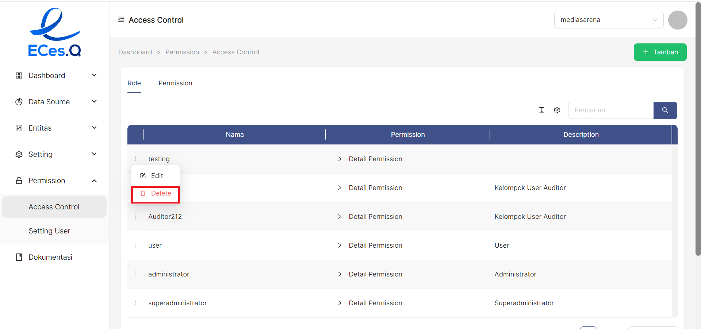<br></br><br></br>

3. Setelah di klik, sistem akan menampilkan po-up konfirmasi yang tercantum keterangan bahwa data yang telah dihapus tidak akan bisa dipulihkan kembali.

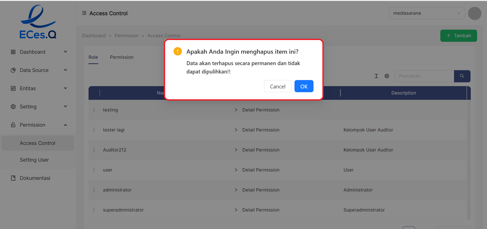<br></br><br></br>

4. Pilih dan klik **Ok** untuk menghapus data dan pilih **Cancel** untuk membatalkan.

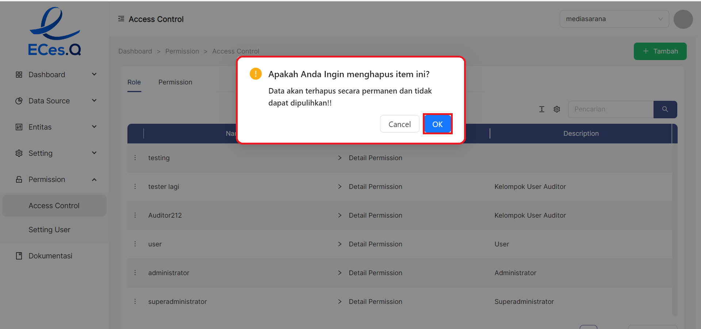<br></br><br></br>

5. Setelah berhasil menghapus data, maka sistem akan menampilkan pesan **Record Delete** pada bagian kanan atas tabel.


---
### __Langkah-langkah menggunakan fitur-fitur pada tabel Access Control pada tab Role__
---
Fitur adalah fitur khusus yang disertakan dalam alat. Fitur yang tersedia pada Access Control Tab Permisison, yakni :

1. Fitur **Show/Hide tabel** Fungsi show/hide tabel adalah untuk menampilkan atau menyembunyikan field pada tabel.

<br></br><br></br>

2. Fitur **Ukuran tabel** Berfungsi untuk mengatur ukuran tabel.

<br></br><br></br>

3. Fitur pencarian data, fungsi pencarian data memungkinkan user memfilter data sesuai dengan kriteria.

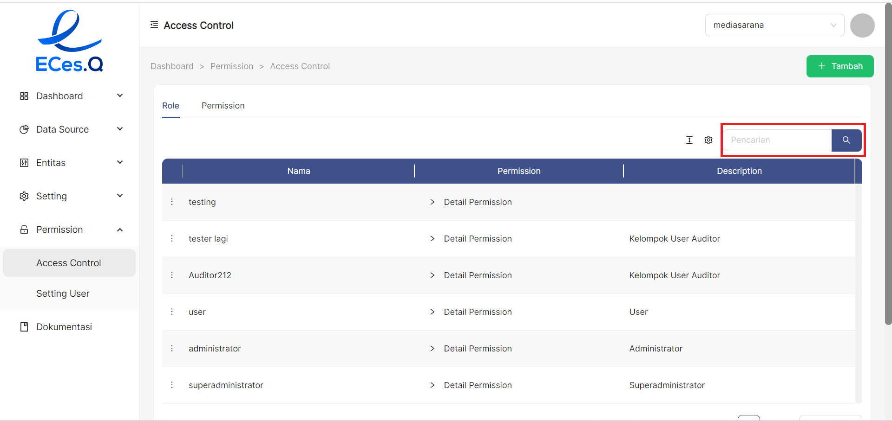<br></br><br></br>

### __Langkah-langkah menampilkan data list Access Control Tab Permission__
---
1. Setelah kita berhasil mengakses menu Access Control maka sistem otomatis akan menampilkan list data pada Tab Permisions.

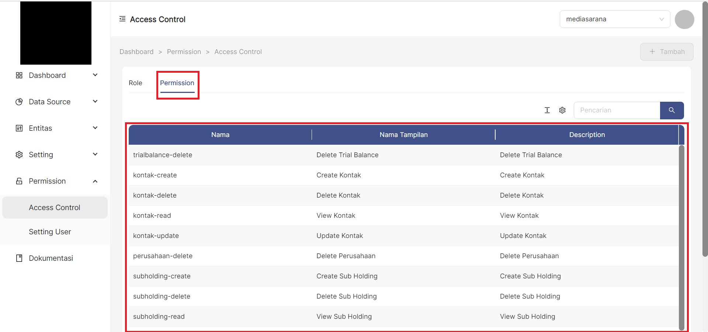<br></br><br></br>

### __Langkah-langkah menggunakan fitur-fitur pada tabel Access Control pada tab Permission__
---
Fitur adalah fitur khusus yang disertakan dalam alat. Fitur yang tersedia pada Access Control Tab Permisison, yakni :

1. Fitur **Show/Hide tabel** Fungsi show/hide tabel adalah untuk menampilkan atau menyembunyikan field pada tabel.

<br></br><br></br>

2. Fitur **Ukuran tabel** Berfungsi untuk mengatur ukuran tabel.

<br></br><br></br>

3. Fitur pencarian data, fungsi pencarian data memungkinkan user memfilter data sesuai dengan kriteria.

<br></br><br></br>

