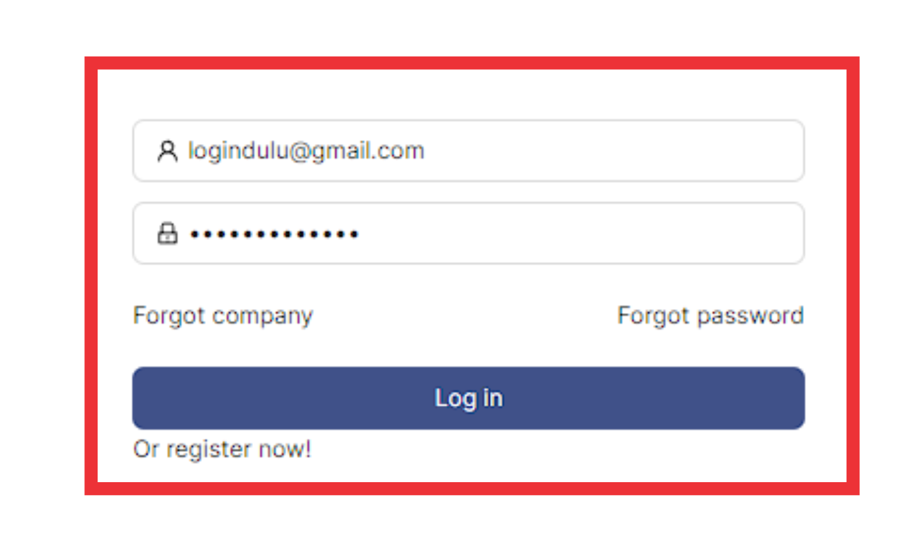

### __Langkah-langkah mengakses menu Access Control__
---
1. Buka halaman website dashboard dengan situs https://analytics.ecespro.id

&nbsp;&nbsp;&nbsp;&nbsp;&nbsp;&nbsp;&nbsp;

2. Setelah itu, jika user belum login maka silahkan login terlebih dahulu.

3. Pilih modul Permisions lalu setelah itu pilih menu Access Control
<!--  -->

### __Langkah-langkah menampilkan data list Access Control__
---
1. Setelah kita berhasil mengakses menu Access Control maka sistem otomatis akan menampilkan list data pada Tab Permisions.
<!--  -->

### __Langkah-langkah menambahkan data Access Control__
Fungsi Tambah data berguna untuk membuat entri atau record baru dalam tabel database. 
<!-- 1. Pilih button **"+ Tambah"** pada bagian kanan atas tabel.

2. Setelah berhasil memilih button **"+ Tambah"** maka sistem akan menampilkan modal pop up yang telah tercantum informasi formulir yang akan di isi oleh user.

3. Pilih **Access Control Kategori**

4. Pilih **Type Access Control**

5. Masukan **Nama Access Control**

6. Pilih **Jenis Kelamin**

7. Masukan **Alamat Access Control**

8. Pilih **Status**

6. Setelah itu, jika user sudah memastikan formulir Access Control telah sesuai maka pilih button **simpan** untuk menyimpan data tersebut dan jika user ingin membatalkan formulir Access Control maka pilih button **batal**.

7. Jika data tersebut berhasil **tersimpan** maka sistem akan menampilkan pesan berhasil pada bagian kanan atas tabel.
 -->

### __Langkah-langkah edit data Access Control__
---
Fungsi Update ini berperan penting dalam memperbarui entri data ketika informasi yang dikandungnya perlu diubah. Dengan fungsi ini user dapat mengubah informasi entri basis data. 
<!-- 1. Pilih titik 3 pada baris data yang ingin dilakukan perubahan data.

2. Pilih dan Klik **Edit**

3. Setelah memilih edit maka sistem akan menampilkan pop-up modal yang pada setiap formulirnya telah tercantum data terakhir di input.

3. Pilih **Access Control Kategori**

4. Pilih **Type Access Control**

5. Masukan **Nama Access Control**

6. Pilih **Jenis Kelamin**

7. Masukan **Alamat Access Control**

8. Pilih **Status**

9. Setelah itu, jika user sudah memastikan formulir Access Control telah sesuai maka pilih button **Simpan** untuk menyimpan data tersebut dan jika user ingin membatalkan formulir Access Control maka pilih button **batal**.

10. Jika data tersebut berhasil **Tersimpan** maka sistem akan menampilkan pesan **Data Updated** pada bagian kanan atas tabel.
 -->

### __Langkah-langkah hapus data Access Control__
---
Fungsi Hapus data ini berguna untuk menghapus data di database yang sudah tidak diperlukan lagi. Ketika menggunakan fungsi ini, user mengakses detail entri dan kemudian menginstruksikan sistem untuk menghapusnya dari database. 
<!-- 1. User memilih icon titik 3 pada baris data pada bagian kiri.

2. Pilih dan klik **Delete**.

3. Setelah memilih button **Hapus** maka sistem akan menampilkan pop-up konfirmasi yang telah tercantum keterangan.

4. Pilih **Ok** jika user ingin menghapus data yang dipilih.

5. Jika data tersebut berhasil **Terhapus** maka sistem akan menampilkan pesan **Record Deleted** pada bagian kanan atas tabel
 -->

### __Langkah-langkah menggunakan fitur-fitur pada tabel Access Control__
---
<!-- Fitur adalah fitur khusus yang disertakan dalam alat. fitur yang telah tersedia pada Bisnis Unit antara lain, yakni :

1. Fitur filter data Access Control Kategori
Fungsi pencarian data memungkinkan user memfilter data sesuai dengan kriteria Access Control Kategori.

2. Fitur pencarian Type Access Control
Fungsi pencarian data memungkinkan user memfilter data sesuai dengan kriteria Type Access Control.

3. Fitur pencarian data
Fungsi pencarian data memungkinkan user memfilter data sesuai dengan kriteria.

4. Fitur show/Hide tabel
Fungsi show/hide tabel adalah untuk menampilkan atau menyembunyikan field pada tabel.

5. Fitur ukuran tabel.
Berfungsi untuk mengatur ukuran tabel.

6. Fitur export PDF
Fungsi dari export PDF yaitu untuk mengeluarkan dan menyimpan data supaya dapat di Import kedalam file berbentuk PDF.

7. Fitur export Excel
Fungsi dari export Excel yaitu untuk mengeluarkan dan menyimpan data supaya dapat di Import kedalam file berbentuk Xls.
 -->

