Menu **Setting User**, berfungsi untuk mendefinisikan Akun User.

### __Langkah-langkah mengakses Setting User__
1. Buka halaman website dashboard dengan situs https://analytics.ecespro.id

```
https://analytics.ecespro.id
```

2. Setelah itu, jika user belum login maka silahkan login terlebih dahulu.

<br></br><br></br>

3. Pilih modul Setting lalu setelah itu pilih menu Setting User

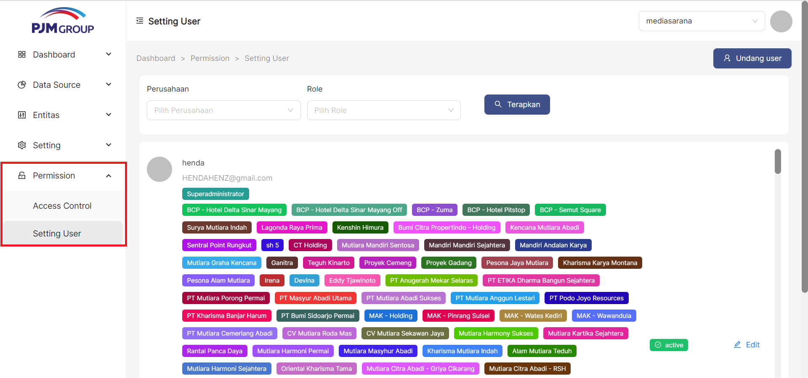<br></br><br></br>


### __Langkah-langkah Menampilkan Daftar Setting User__
1. Setelah kita berhasil mengakses menu Setting User maka sistem otomatis akan menampilkan data list Setting User.

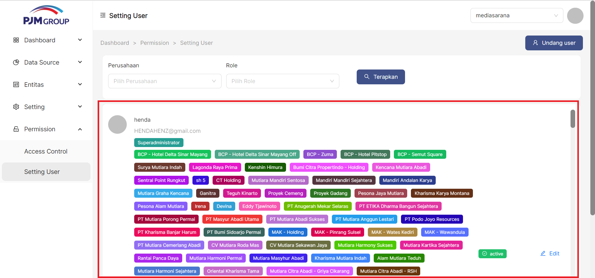<br></br><br></br>

---

### __Langkah-langkah Menambah Setting User__
untuk menambahkan Setting User klik tombol **" Undang user"** pada pojok kanan atas tabel

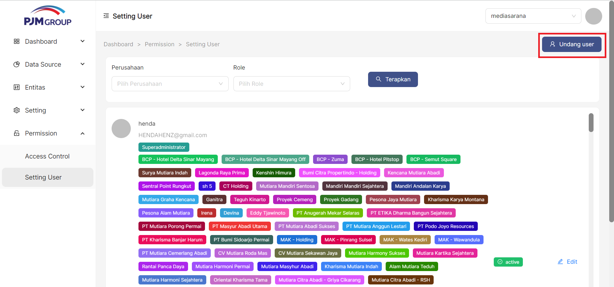<br></br><br></br>

1. Setelah berhasil memilih button **"Undang user"** maka sistem akan menampilkan modal pop-up yang telah tercantum informasi formulir yang akan di isi oleh user.

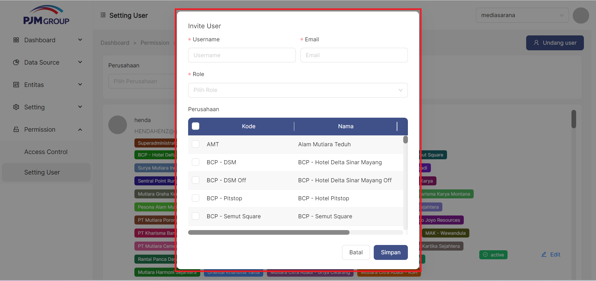<br></br><br></br>

2. Masukan username

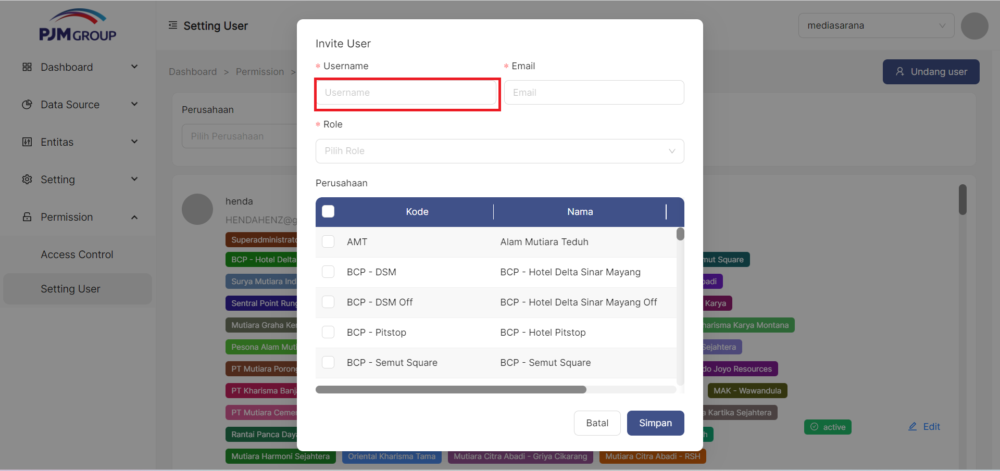<br></br><br></br>

3. Masukan Email

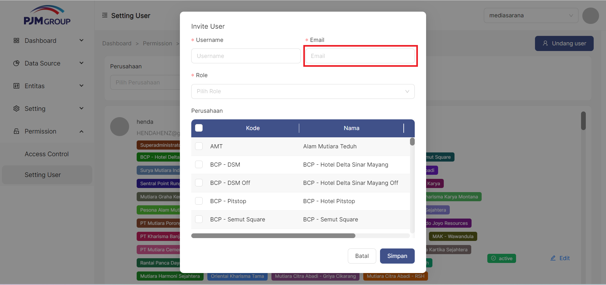<br></br><br></br>

4. Pilih Role

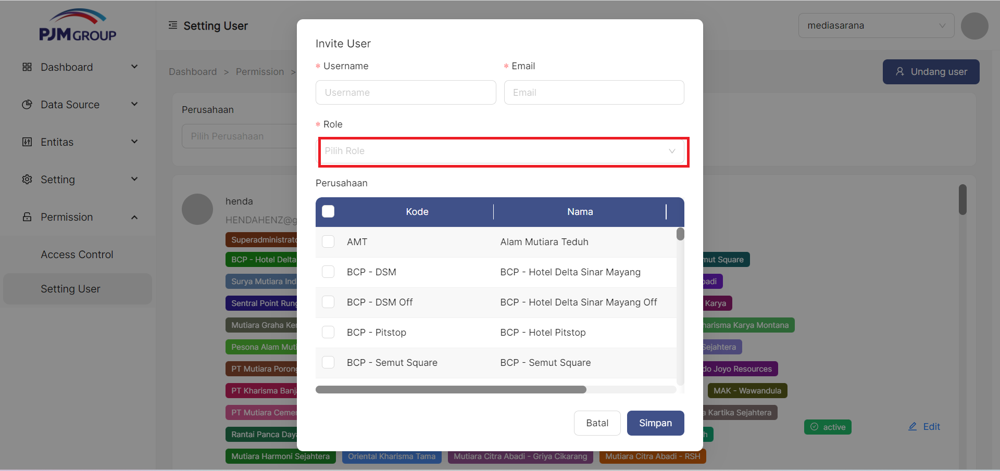<br></br><br></br>

5. Pilih Perusahaan

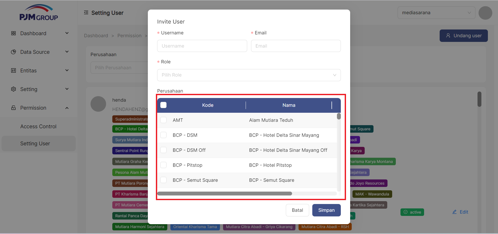<br></br><br></br>

6. Klik tombol Simpan

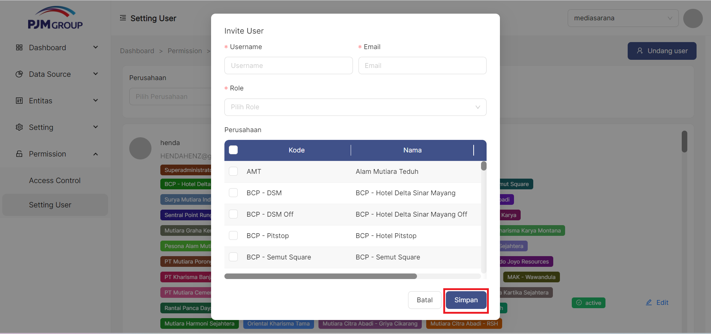<br></br><br></br>

---

### __Langkah-langkah Edit Setting User__
untuk merubah Setting User klik tombol **" Edit"** pada pojok kanan tabel

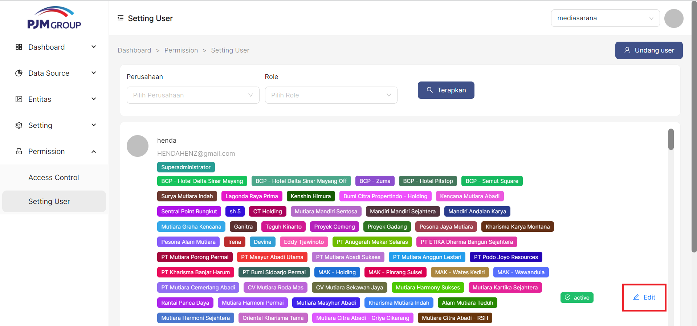<br></br><br></br>

1. Setelah berhasil memilih button **"Edit"** maka sistem akan menampilkan modal pop-up yang telah tercantum informasi formulir yang akan di ubah oleh user.

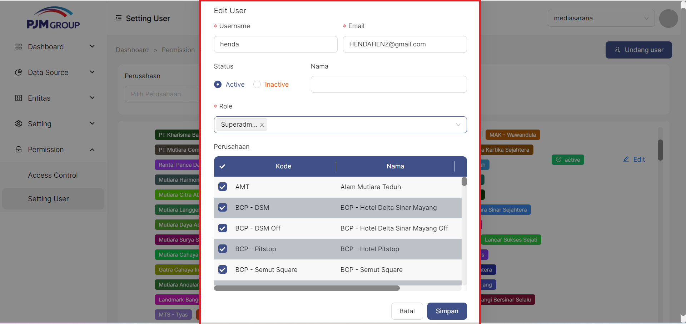<br></br><br></br>

2. Masukan username

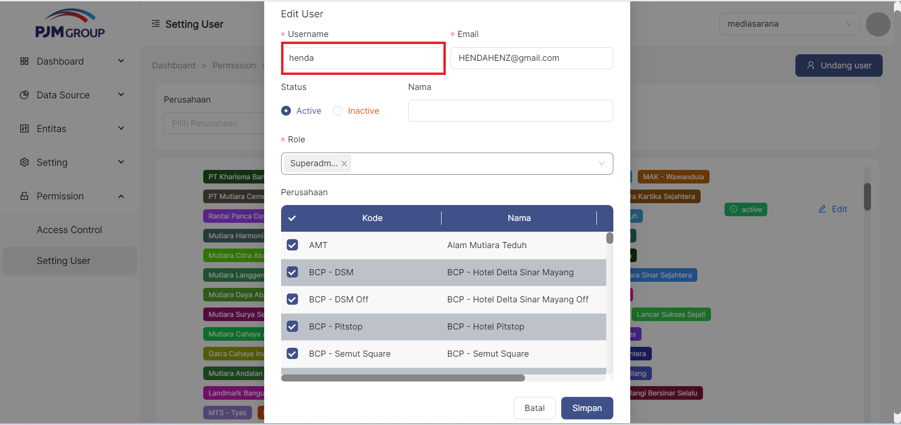<br></br><br></br>

3. Masukan Email

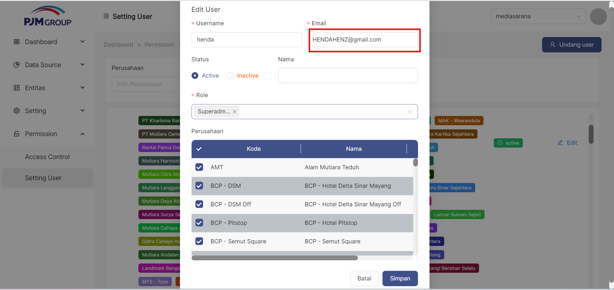<br></br><br></br>

4. Pilih Status

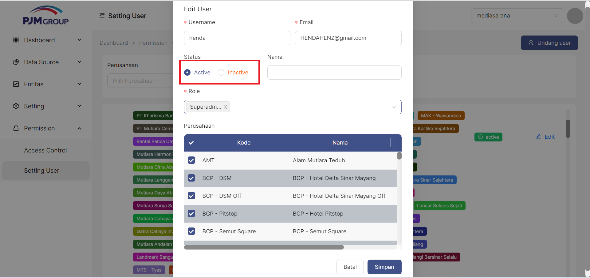<br></br><br></br>

5. Masukan Nama

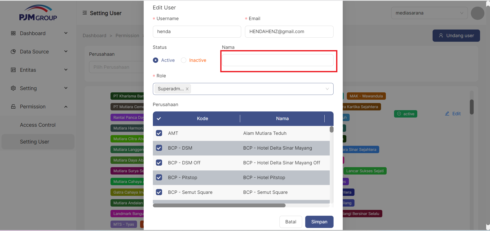<br></br><br></br>

6. Pilih Role

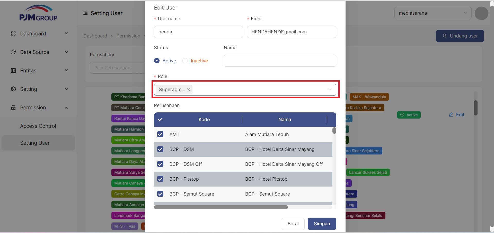<br></br><br></br>

7. Pilih Perusahaan

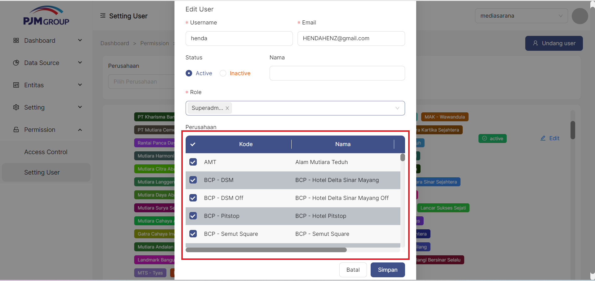<br></br><br></br>

8. Klik tombol Simpan

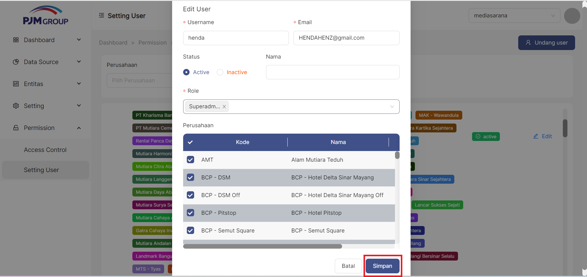<br></br><br></br>

9. jika tidak jadi mengedit bagian Setting User bisa klik simbol Batal


---

### __Langkah-langkah menggunakan fitur-fitur pada tabel Setting User__

Fitur adalah fitur khusus yang disertakan dalam alat. fitur yang telah tersedia pada Bisnis Unit antara lain, yakni :

1. Fitur filter Role
Fungsi filter berdasarkan Role memungkinkan user memfilter data sesuai dengan kriteria.

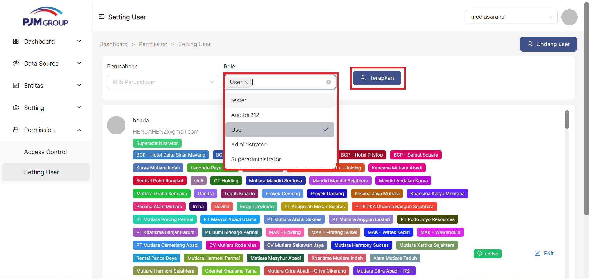<br></br><br></br>

2. Fitur filter Perusahaan
Fungsi filter berdasarkan Perusahaan memungkinkan user memfilter data sesuai dengan kriteria.

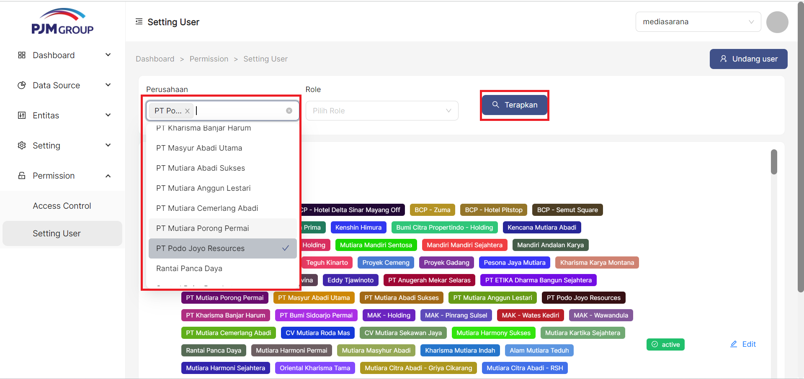<br></br><br></br>

