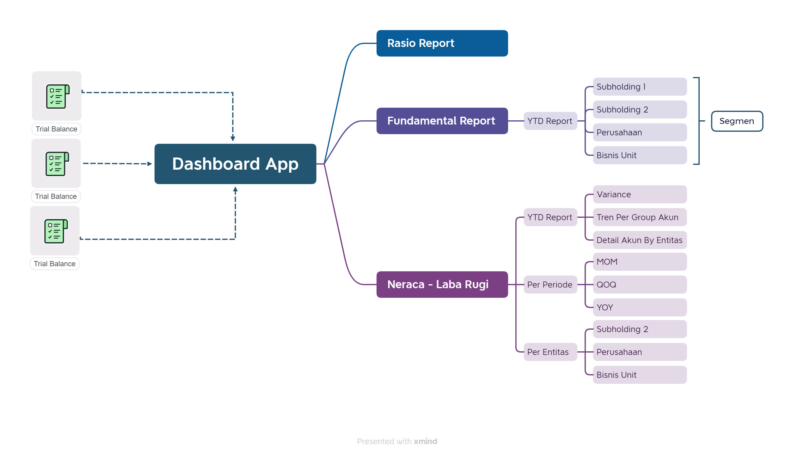
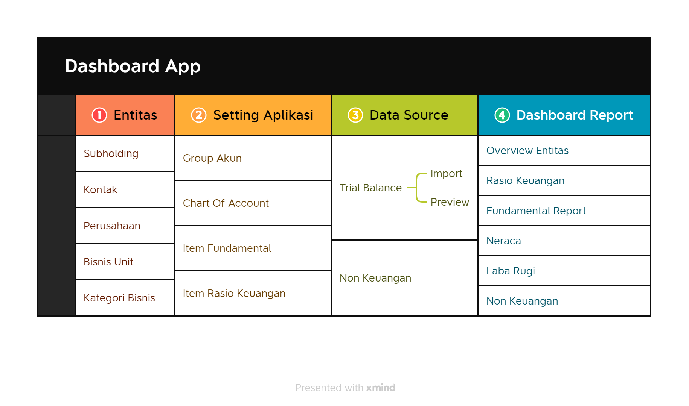

# Introduction

## Tentang Aplikasi

**Financial Statement Analytics Dashboard**.

Aplikasi yang dapat menyajikan laporan keuangan dengan lebih menarik, cepat serta mudah dipahami. Laporan dapat ditampilkan berdasarkan segmen entitas bisnis (Subholing, Perusahaan dan Unit Bisnis) dan juga berdasarkan segmen periode tertentu **(YTD, MOM, QOQ atau YOY)**

Sehingga aplikasi dapat membantu manajemen untuk membuat keputusan secara lebih cepat, tepat dan akurat.

## Bagaimana Aplikasi Berjalan

### Workflow Report

### Application Process

## Modul Aplikasi

List modul **Financial Statement Analytics Dashboard**.

- Dashboard
  - Overview Entitas Bisnis
  - Fundamental Report
  - Neraca
  - Laba Rugi
  - Non Keuangan
  
- Data Source
  - Trial Balance
  - Non Keuangan

- Entitas Bisnis
  - Subholding
  - Kontak Person
  - Perusahaan
  - Bisnis Unit
  - Kategori Bisnis

- Setting
  - Group Akun
  - Chart Of Account
  - Kategori Chart Of Account
  - Setup Fundamental Report Item
  - Setup Rasio Keuangan
